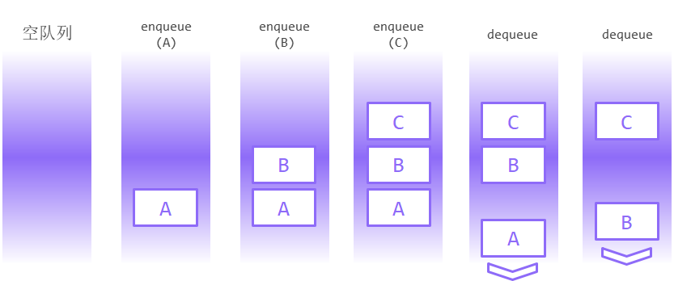
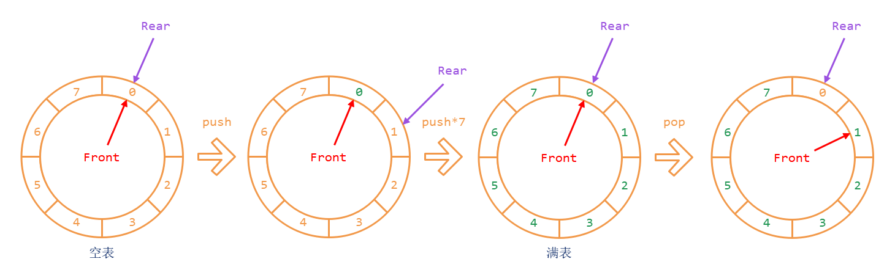

# 栈和队列

线性表是一个非常“开放的”数据结构，您可以访问、插入和删除线性表上的任何一个数据单元。但在实际的计算模型中，并不是所有的数据结构都允许您这样做。

本章介绍的**栈**（stack）、**队列**（queue）以及**双端队列**（deque）就是典型的“访问受限制”的数据结构，它们的实现都是以线性表作为基础的。另一种经典的限制访问的数据结构是**优先队列**（priority queue），它需要以树作为基础，因此本章暂时不讨论它。

栈和队列限制了用户访问元素的范围，这使得它们能够防止用户做出对进程、系统、计算机或网络有害的“非法”行为，在《操作系统》和《网络原理》中都能看到它们的应用。

## 栈

**栈**（stack）是一种特殊的线性表。对于栈`S[0:n]`，它的访问、插入、删除操作均只能对**栈顶元素**（top或peek，即栈的最后一个元素）`S[n-1]`进行。

* 栈的访问就是取`S[n-1]`。

* 栈的插入就是在`S[n-1]`后面插入新的元素（称为**入栈**或**推入**，push）。

* 栈的删除就是将`S[n-1]`从栈中删除（称为**出栈**或**弹出**，pop）。

  由于弹出后的元素往往另有他用，`pop`操作会将被删除的栈顶元素返回。

### 用向量实现栈

由于栈实质上是对线性表的访问权限作出限定，所以很容易在向量的基础上建立栈。

```c++
template <typename T>
class Stack : protected Vector<T> { // 利用protected继承做访问限制
public:
    T& top() const { return Vector<T>::data()[Vector<T>::size()-1]; }
    void push(T e) { Vector<T>::push_back(e); }
    T pop() { return Vector<T>::pop_back(); }
};
```

> 其中`push_back`和`pop_back`分别表示在向量的末尾插入或删除元素，这一过程可能会引发向量的扩容和缩容。
>
> 为了效率，笔者不考虑鲁棒性问题：对空栈使用`top`和`pop`会引发错误。

显然取顶的时间复杂度是$O(1)$，入栈和出栈的时间复杂度在分摊意义下也是$O(1)$。

栈的操作到这里就介绍完了。

### 栈的性质：后进先出

因为栈只能从尾部进行操作的特性，栈有可能被写作`[ S0, S1, S2, ..., Sn-1 >`的形式，左侧的中括号表示不可操作的一端（**盲端**），右侧的尖括号表示可操作的一端（**自由端**）。更常见的一种表示方法是把它竖过来：


如图所示，可以把栈想成一个桶，盲端是桶的底部，自由端（栈顶）是桶中最上面的物品。于是，`push`操作就是往桶里放东西，后放的东西总是放在先放的东西的上面，像上图中，B放在A上面，C放在B上面。而要取东西（`pop`）的时候，每次只能取桶里最上面的东西，也就是栈顶元素。在上图里，为了把B取出来，必须先把B上面的C取出来。

就像列表相关问题经常用链式图帮助思考一样，处理和分析栈的相关问题经常要用到上面这种桶式图。

从上图中不难发现，栈的最重要的性质是：<u>先入栈的元素后出栈，后入栈的元素先出栈</u>，简称为“**后进先出**”（**LIFO**, Last In First Out）。生活中有不少LIFO的例子，比如，桌子上一大摞书需要先搬开上面的才能拿下面的，这些现象被抽象化到计算机中处理就对应栈这种数据结构。

和栈相关的题目，通常有两个考点。

1. 考察对栈性质（也就是LIFO）的理解。
2. 在访问受限的情况下设计算法。这个比较少见。

在下面的几节，将介绍栈的几个应用以加深您对栈性质的理解。这些应用本身也是重要的考点，栈的大多数题目都出自这些应用。

### 出栈序列

这一小节讨论**出栈序列**（又称**栈混洗序列**）问题。
$$
\mathbf{定义（出栈序列）}\\
\begin{align}
&给定一个序列A=(a_1,a_2,\dots,a_n)，\\
&如果对于序列B=(b_1,b_2,\dots,b_n)，\\
&存在对空栈S的入、出栈操作各n次的操作序列O=(o_1,o_2,\dots,o_{2n})，\\
&使得当序列O中的入栈操作为依次将a_1,a_2,\dots,a_n入栈时，\\
&序列O中的出栈操作出栈的元素恰好依次为b_1,b_2,\dots,b_n，\\
&则称序列B为序列A的一个\mathbf{出栈序列}。
\end{align}
$$

一个显而易见的结论是：<u>出栈序列是全排列的子集</u>。

以入栈序列为`(1,2,3)`为例，则`(3,2,1)`是它的一个出栈序列，对应的操作序列为`(push,push,push,pop,pop,pop)`。您可以自己验证，`(2,3,1)`、`(2,1,3)`、`(1,3,2)`以及`(1,2,3)`自身，都是它的一个出栈序列；而`(3,1,2)`则无法成为一个出栈序列。

> 事实上，如果入栈序列是$(1,2,\dots,n)$​​，则$B=(b_1,b_2,\dots,b_n)$​​是出栈序列，<u>当且仅当不存在“312”模式</u>。即：不存在$i<j<k$​，使得$b_j<b_k<b_i$​​​。这个命题您可以在阅读了出栈序列的相关知识后自己证明。

根据出栈序列的定义，可以立刻得到，从$O$到$B$是一个满射。

那就自然地能想到，从$O$到$B$也应该是一个单射。​

> 这个问题可以用递归法分析，具体证明过程您可以自己补全。
>
> 设$O=(o_1,o_2,\dots,o_{2n})$​​中的最后一个`push`是$o_j$​​​，则下一个操作$o_{j+1}$​​一定是`pop`，且$o_j$​入栈的和$o_{j+1}$​出栈的元素都是$a_n$​。
>
> 那么，将$o_j$、$o_{j+1}$和$a_n$删除就递归到了$n-1$的情形。递归边界$n=1$结论显然。

这样，每个出栈序列就唯一对应了一个操作序列。

### 出栈序列的数量

从上一小节的分析可知，给定入栈序列的情况下，出栈序列的数量等于操作序列的数量，而操作序列$O=(o_1,o_2,\dots,o_{2n})$的数量和入栈序列的内容无关，只和入栈序列的长度$n$​相关。

在这一小节中，先设长度为$2n$​的操作序列$O$​的长度是$f(n)$​​。

为了求解这个函数，需要确定操作序列$O$需要满足的条件。

1. 包括$n$个`push`和$n$个`pop`。

2. 对于操作序列的任意一个<u>前缀</u>，前缀中的`push`数量一定<u>不小于</u>`pop`数量。

   > 否则，在这个前缀的操作结束之后，栈的规模会变成负数，这是不可能的。

容易验证满足上述两个条件的序列，也一定是合法的、可以生成对应出栈序列的操作序列。下面利用这两个条件，去推导$f(n)$满足的递归式。

> 由于**条件2**，$o_1$必定是`push`。设$o_1$入栈的$a_1$在$o_k$时出栈，其中$1<k\le2n$。
>
> 又由于$a_1$在$o_1$的时候被压入了栈的底部，所以$o_k$之后，栈变成了空栈。因此，$(o_1,o_2,\dots,o_k)$和$(o_{k+1},o_{k+2},\dots,o_{2n})$各自都是一个比较短的、符合条件的操作序列。因而$k$必须是偶数，设$k = 2i$，其中$1\le i \le n$。
>
> 在这两个操作序列中，$o_1$和$o_k$已经被确定了，而$(o_2,o_3,\dots,o_{k-1})$有$f(i-1)$种可能性，$(o_{k+1},o_{k+2},\dots,o_{2n})$有$f(n-i)$​种可能性。于是：
> $$
> f(n)=\sum_{i=1}^{n}f(i-1)f(n-i)
> $$

上述递归方程可以被改写为：
$$
f(n+1)=\sum_{k=0}^n f(k)f(n-k)
$$
使用生成函数法可以得到，这个递归方程可以解出显式的通项公式：
$$
f(n)=\frac{C_{2n}^n}{n+1}=\frac{(2n)!}{(n+1)!\cdot n!}
$$
这个数被称为**Catalan数**，记为$\mathrm{Catalan}(n)$​。

> 使用数学归纳法可以证明，这个递归方程的解确实是$\mathrm{Catalan}(n)$​​，不过数学归纳法要先猜出答案才能证明，要求出这个答案，比较好的方法还是**生成函数法**。
>
> 生成函数法是《概率统计》学科的内容，但并不在考研数学的要求范围内。因此，如果您此前不了解这个方法，也没有必要特意去了解它。考研计算机不是考数学，不会考到这么冷门的知识点。

### 拓展：Catalan数的通项公式

如果对于Catalan数的推导过程有兴趣，自己却一时没有头绪，则可以参考下面的解法。
$$
设H(x)=\sum_{n=0}^\infty h_n x^n，其中h_n为待求解的\mathrm{Catalan}(n)\\
则H^2(x)=\sum_{n=0}^\infty h_n x^n\sum_{k=0}^\infty h_k x^k=\sum_{n=0}^\infty\sum_{k=0}^\infty h_nh_k x^{n+k}\\
=\sum_{n=0}^\infty x^n\sum_{k=0}^{n}h_kh_{n-k}=\sum_{n=0}^\infty h_{n+1}x^n=\frac{H(x)-h_0}x\\
由H(0)=h_0=1，解得H(x)=\frac{1-\sqrt{1-4x}}{2x}\\
将分子上的二次根式\mathrm{Taylor}展开得到H(x)=\sum_{n=0}^\infty \frac{C_{2n}^n}{n+1}x^n
$$

> 代入$h_0=1$​用二次方程求根公式就可以解出$H(x)$​；
>
> 在$x=0$​处，$H(x)$​的解析解为“$\frac{0}{0}$​”型不定式，需要通过L'Hospital法则满足$H(0)=1$​的限制条件。这个条件舍弃了二次方程求根公式的一个根。

如果您熟悉生成函数法，则上面的解法难度并不高，但是最后一步的Taylor展开较为繁琐。在考场上如果现推Catalan数通项公式，需要的时间比较多。

此外，还有一种基于一一映射的计数方法，这种方法相对生成函数法更加巧妙。

> 条件1：在长度为`2n`的序列中，随机安排`n`个`push`和`n`个`pop`，可能的情况有$C_{2n}^n$种。
>
> 条件2：如果满足条件1而不满足条件2，则必定存在一个最小的`k`，使得序列的前`k`项中，`push`比`pop`少1个；后`n-k`项中，`push`比`pop`多1个。那么，保持后`n-k`项不变，令前`k`项的`push`变为`pop`、`pop`变为`push`，则得到了一个新的序列，这个序列中有`n+1`个`push`和`n-1`个`pop`。可以证明这是一个一一映射。因此，不满足条件的情况有$C_{2n}^{n+1}$种。
>
> 因此，出栈序列的数量为$C_{2n}^{n}-C_{2n}^{n+1}=\frac{1}{n+1}C_{2n}^n$。

<u>递归方程法和一一映射法，是计数问题的两种基本方法</u>。相对来说，递归方程法比较常规，很容易列出递归方程，但计算比较复杂；一一映射法则需要较高的构造技巧，而计算比较简单。

### 合法括号序列

Catalan数不仅仅是出栈序列（合法操作序列）的数量，同时也是其他很多问题的答案。这些问题的解决，也普遍具有两条路径：

1. 从模型角度入手，将其变换为等价的出栈序列或合法操作序列问题，然后套用Catalan数的通项公式。（一一映射法）
2. 从计算角度入手，列出递归方程，发现和Catalan数的递归方程的相似性后，利用已知的Catalan数通项公式求解。（递归方程法）

一个典型的例子是**合法括号序列**问题。左括号和右括号组成的合法括号序列，可以用以下的递推定义：

1. 空串是合法括号序列。
2. 如果`S`和`T`是两个合法括号序列，那么`(S)T`也是合法括号序列。

> 您会发现，从`(S)T`递归到长度更短的`S`和`T`，这个递归方法和前面推导合法操作序列数量时使用的递归方法如出一辙，因此，用`push`代替`(`，用`pop`代替`)`，就可以建立合法括号序列到合法操作序列的一个映射。容易证明这是一个双射，从而<u>化归到出栈序列</u>的问题上来。
>
> 另一个方向也是类似的，容易通过**条件2**得到和之前完全一样的递归方程，从而解出Catalan数的通项公式。
>
> > 在这个问题上，从模型角度入手建立一一对应是显然的。但有一些问题，模型上可能一时看不出来，但通过计算角度发现结果是Catalan数之后，就可以自然地联想到从模型上可以建立一一对应。
> >
> > 比如，<u>将凸n边形通过若干条互不相交的对角线划的分为n-2个三角形，划分方法数量</u>。
> >
> > 这个问题的答案也是Catalan数，由于和考研计算机关系不大，这里不再展开。您可以自己分析这个问题。

从而，在讨论合法括号序列的问题时，可以自然地从栈的角度思考问题。<u>数量上相同只是初步的结论，更重要的是建立了一一对应</u>。比如，借助这个一一对应，就可以用栈来判断一个括号序列是否合法。

```c++
// 算法3.1 - 合法括号序列
// 输入：一个只包含"("和")"的字符串
// 输出：这个字符串是否为合法的括号序列
bool isLegal(string seq) {
    int stackSize = 0;        // 这里不需要真的实现栈
    for (char c : seq) {      // 因为用到的只有栈的规模
        if (c == '(') {
            ++stackSize;      // 左括号对应push
        } else {              // 右括号对应pop
            if (--stackSize < 0) { 
                return false; // 如果对空栈pop则不合法
            }
        }
    }
    return stackSize == 0;    // 保证左右括号数量相同
}
```

设输入序列的长度为$2n$，则上述算法的时间复杂度为$O(n)$，其中对于合法的括号序列，时间复杂度为$\Theta(n)$；空间复杂度为$O(1)$。

### 在表达式和栈之间建立联系

括号主要的用处，就是给表达式规定计算顺序。所以，自然地就能想到，栈也可以被用来计算表达式。

回顾上一小节，括号序列和栈的操作序列相对应，而一个出栈序列，是由入栈序列和操作序列共同决定的。从信息的角度看，如果要在出栈序列和表达式之间建立联系，且已知操作序列和括号序列之间有联系，那么顺理成章地，就会想到，入栈序列应当和表达式中的其他部分——也就是操作数和运算符建立联系。

那么接下来，就需要推导这个联系了。为了更清晰地展示推导过程，以下采用表达式`1+2*(3-4)`作为例子。

1. 建立完整的括号序列。

   > 这样做的目的是，让<u>括号序列</u>能够完全地和<u>运算次序</u>形成一一对应。原有的表达式中，有一些括号被省略了，这一步的目的是将它补全。

   在例子中，`1 + 2 * ( 3 - 4 )`被变换为`((1)+((2)*((3)-(4))))`。

   > 为什么要给每个数外部也加上一个括号？
   >
   > 这是因为，目标是将入栈序列，和“操作数与运算符”之间建立联系。在表达式中，操作数和运算符一共有7个（`1,2,3,4,+,*,-`），因此入栈序列的长度为7，相应地，操作序列的长度应该为14，也就是说括号序列的长度应该为14（7对括号）。
   >
   > 在这7对括号中，有3对是用来描述<u>运算符的计算次序</u>的，而另外4对则用来描述<u>操作数的位置</u>。这样才能达成一一对应。

2. 构造入栈序列和出栈序列。

   利用第1步中建立的“括号对”和“操作数与运算符”的一一对应关系，决定每一对括号对应的入栈或出栈的元素。

   如果某一对括号对应的运算符或者操作数为`c`，那么将左括号变换为`push(c)`，右括号变换为`pop`（出栈元素恰好为`c`），就得到了一个带参数的操作序列。

   > 在例子中，第1步加入了7个括号，其中3对用来描述3个运算符的运算次序，4对用来描述4个操作数的位置，也就是说，每一对括号都对应了一个运算符或者操作数。
   >
   > 它对应的带参数操作序列是：`push(+) push(1) pop push(*) push(2) pop push(-) push(3) pop push(4) pop pop pop pop`。
   >
   > 对应的入栈序列是：`+ 1 * 2 - 3 4`。
   >
   > 对应的出栈序列是：`1 2 3 4 - * +`。

定义这个入栈序列为**前缀表达式**（又称**波兰式**），出栈序列为**后缀表达式**（又称**逆波兰式**）。您所熟知的数学的表达式形式，即`1+2*(3-4)`，被称为**中缀表达式**。

> 概念来自于<u>运算符相对于操作数的位置</u>。在前缀表达式中，运算符出现在它所对应的操作数之前；后缀表达式放在之后，而中缀表达式的运算符出现在中间。
>
> 后缀表达式和前缀表达式的性质大多是对偶的，而后缀表达式更适合使用计算机计算，因此，在考研中基本上不会出现前缀表达式，而<u>后缀表达式却是考研几乎必考的超级重点之一</u>。

以上介绍了一种中缀表达式转换为后缀表达式的方法：利用括号序列和操作序列的联系，找到表达式对应的出栈序列。这一联系是本质的。

> 为了考试时加快做题速度，可以用一些技巧简化上述方法。比如：
>
> 1. 补全运算符对应的括号，但不补操作数对应的括号。
> 2. 对于每一对括号，设它对应的运算符为`c`，则删掉左括号，将右括号替换为`c`。
> 3. 如此就直接得到了后缀表达式。
>
> 容易发现，上面的“简化方法”和之前介绍的“完整方法”从思想上是一致的。

### 后缀表达式转换为中缀表达式

注意到，中缀表达式是由“操作数与运算符”以及“括号序列”共同组成的，所以知道中缀表达式，也就知道了操作序列的每一步入、出栈了什么元素，从而得到入栈序列（前缀表达式）和出栈序列（后缀表达式）。从信息的角度看，中缀表达式中包含的信息，包括了前缀表达式和后缀表达式所需的信息。

但是，后缀表达式仅仅是由“操作数与运算符”组成的，它本身只是一个出栈序列。从前面的小节中您已经知道，给定出栈序列而不给定操作序列，则有$\mathrm{Catalan}(n)$​​种可能的入栈序列。所以，如果仅仅依赖后缀表达式的*文本*，而不借助其他先验信息，那么从后缀表达式反推中缀（前缀）表达式是不可能的、是缺少信息的。要能够实现后缀表达式到中缀表达式的转换，必须要知道*文本*以外的额外信息。

这个先验的额外信息就是：<u>每个运算符需要的操作数数量</u>。

> 在常见的运算符中，加、减、乘、除、乘方，操作数数量都是2；阶乘的操作数数量是1。
>
> 需要特别注意的是，当“减号”和“负号”采用同一符号`-`时，它的操作数数量是不确定的，这一不确定性会导致后缀表达式出现歧义。
>
> 比如：对于后缀表达式`1 2 - 3 - -`，它的三个`-`中有一个代表负号，另外两个代表减号。因此，这个后缀表达式可能对应3种不同的中缀表达式：`1-((-2)-3)`、`(1-2)-(-3)`和`-((1-2)-3)`。
>
> 而对于中缀表达式，您可以根据`-`之前是否为操作数，来区分“减号”和“负号”，不会导致歧义。

下面解释，这个先验的额外信息是如何帮助后缀表达式转换成中缀表达式的。这一部分的内容和考研无关，您可以略过它。

假设某个运算符`#`的操作数数量是2。在补全了所有括号的中缀表达式中，这个操作数出现在`((A) # (B))`这个片段里，其中`A`和`B`都是中缀表达式。按照上一节的方法，这个片段化为后缀表达式是`A' B' #`，其中`A'`和`B'`是`A`和`B`对应的后缀表达式。于是得到：

> **命题1. 对于后缀表达式`R`中的每个运算符`#`，都存在`R`中的一个连续的子序列`R'`，`R'`是以`#`结尾的后缀表达式。**

在之前讨论一般的出栈序列的时候，`A'`和`B'`的划分是任意的，所以会得到Catalan数的递归方程。但在讨论后缀表达式的时候，需要受到<u>操作数数量的限制</u>，因此`A'`和`B'`的划分不是任意的。事实上，只有一种划分是合法的。

> **命题2. 后缀表达式的末尾必定是运算符**。（显然）
>
> 对于操作数和运算符组成的序列$C=(c_1,c_2,\dots,c_n)$，定义
> $$
> f(c_i)=\begin{cases}
> 1,&c_i是操作数,\\
> 1-\mathrm{Cnt}(c_i),&c_i是运算符，\mathrm{Cnt}表示运算符的操作数数量
> \end{cases}\\
> f(C)=\sum f(c_i)
> $$
> **命题3. 若后缀表达式$R$​​合法，那么$f(R)=1$​​​​**​。（可递归证明）
>
> **命题4. 对于合法后缀表达式$R$​​​的任意前缀$R_s=(r_1,r_2,\dots,r_s),s<n$​​​​​，始终有$f(R_s)\ge1$​**​​。
>
> 这个命题的证明是有一定难度的。如果存在$f(R_s)\le 0$，那么由于操作数的$f(c_i)=1>0$，所以不妨假设$r_s$是运算符。那么必定存在某个$(r_t,r_{t+1},\dots,r_s),1\le t<s$是以$r_s$​结尾的后缀表达式。
>
> 那么$f(r_t,r_{t+1},\dots,r_s)=1$​，从而$f(R_{t-1})=f(R_s)-1< 0$​，其中$t-1<s$​。
>
> 最终递降到$0=f(R_0)<0$，矛盾。
>
> **命题5. 对于以`#`结尾的后缀表达式$R$​，只有唯一一种合法的划分方式使$R=(A',B',\#)$​**​。（根据命题3,4，可以反证得到）

递归地进行“唯一合法的划分”，就可以得到最终的中缀表达式。

类似地，您可以得到前缀表达式转换成中缀表达式的手段。

> 上面的转换方式并不实用。
>
> 实际转换的时候，通常利用表达式树作为中介进行转换，表达式树的内容将会在后面的章节介绍（之后的几个小节，在表达式树的部分也会进一步深化）。在本章介绍表达式，是希望您在思维中巩固“栈”和“表达式”之间的联系。

### 后缀表达式转换为前缀表达式

在上一小节中使用了一个$f(\cdot)$函数用来辅助证明，这个函数并不是凭空产生的，而是另一个栈的产物：

将后缀表达式中的操作数，用`push`替代；将后缀表达式中的运算符，用`pop ... pop push`替代，其中`pop`的数量等于这个运算符的运算所需操作数数量；上述替代之后，在结尾处增加一个`pop`。

> 由上一小节的**命题3、4**，这样替代得到的操作序列是一个<u>合法的操作序列</u>。

在这个替代的过程中，每一个运算符或者操作数，都恰好对应了一个`push`，所以可以让这个`push`入栈的元素，恰好是这个运算符或者操作数。这相当于，<u>将后缀表达式作为*入栈序列*，输入到这个操作序列中</u>，从而得到了一个新的带参数操作序列。

那么，您会自然地想要分析对应的出栈序列。仍然以前面的`1 2 3 4 - * +`作为例子，它对应`push(1) push(2) push(3) push(4) pop pop push(-) pop pop push(*) pop pop push(+) pop`，从而可以得到出栈序列是`4 3 - 2 * 1 +`。这恰好是<u>倒序的前缀表达式</u>。

对偶地，您可以得到前缀表达式转换成后缀表达式的手段。

### 后缀表达式的计算

后缀表达式的计算是清华考试的传统题型之一，是非常重要的考点。

要计算后缀表达式，只需要对上一小节介绍的栈作出一点点修改：

1. 将后缀表达式中的操作数`x`，用`push(x)`替代。

2. 将后缀表达式中的运算符`#`，用`x = pop(), y = pop(), push(y#x)`替代。

   > 这保证了在整个操作序列的执行过程中，栈里的所有元素都是数而不是运算符。

3. 上述操作序列最终会使栈中留下1个数，这个数就是后缀表达式的计算结果。

这个算法的正确性，可以用递归法证明。

> 一方面，从之前的分析中可以知道：对于以运算符`#`结尾的后缀表达式`R`，可被唯一划分为`A B #`，其中`A,B`也是后缀表达式，且`c(R) = c(A) # c(B)`，这里`c(R)`表示后缀表达式`R`的计算结果。
>
> 另一方面，递归边界为只包含一个操作数的后缀表达式，它的计算结果就是这个操作数自身。

您可以自己实现这一算法的代码。

```c++
// 算法3.2 - 后缀表达式的计算
int SuffixExpression::getResult() const {
    Stack<int> S;                               // 计算使用的辅助栈
    traverse([&](Rank, const ExpressionElement& e) -> void {
        int opCount = e.operationNumberCount(); // 获取运算符所需的操作数数量，操作数此值为0
        S.push(e.apply(Vector<int>(opCount, opCount, [&](int) -> int {
            return S.pop();                     // 进行opCount次pop
        })));                                   // 运算后push回去
    });
    return S.pop();                             // 最终栈里剩下了一个计算结果
}
```

考试中实际出现的后缀表达式计算题目，可以使用上述算法手工计算。

> 不过和之前一样，笔者推荐使用表达式树而不是栈进行计算。
>
> 诚然，表达式树的做法比栈要复杂一些；但表达式树的方法更加清晰，更加适合答题结束后的检查，更加不容易出错。

知道后缀表达式如何计算之后，由于之前已经介绍过各种表达式之间互相转换的方法，所以您也就能够写出计算前缀表达式和中缀表达式的算法了。

> 前面的小节里提到过，后缀表达式会混淆“减号”和“负号”。
>
> 所以，要计算中缀表达式，则在将它转换成后缀表达式的时候，要对“减号”和“负号”加以区分。常用的手段是，使用一个非数学的符号（如`$`）代替“负号”，让`-`仅仅作为“减号”而不至于产生歧义。

### 无返回值的尾递归

在这一小节，讨论栈的另一个应用：**尾递归消除**问题。

在上一章里已经介绍了如何消除简单尾递归。对于一般形式的尾递归，函数对自身的调用被限制在了返回语句，但是<u>在返回语句可能调用自身不止一次</u>。如果像简单尾递归一样直接改动参数（作为循环变量），就无法恢复原来的参数，从而在第一次调用自身之后，就不知道第二次调用自身该使用什么参数了。

为此有多种解决方法，分别针对不同的具体情况。

情况1：**无返回值函数，在尾部连续调用。**

这类函数的模板如下。

```c++
void recursiveFunction(ParameterType para) {   // 递归版本的函数模板
    if (recursiveBorder(para)) {               // 判断是否到达递归边界
        borderProcedure(para);
    } else {
        basicProcedure(para);                  // 程序体
        for (int i = 0; i < dependentParameters.size(); ++i) {
            recursiveFunction(dependentParameters[i](para));
        }                                      // 尾递归
    }
}
```

利用栈，上述函数可以被改写为以下的迭代版本。

> 尾递归消除方法的正确性，在这一章不进行证明，因为利用下一章介绍的树，能理解起来更加清晰。
>
> 不过，您可以自己尝试去完成这一证明工作（可能数学性会强一些）。

```c++
void iterativeFunction(ParameterType para) {    // 迭代版本的函数模板
    Stack<ParameterType> S;  // 用来存储所有待执行的函数的参数
    S.push(para);            // 从外部传进来的参数开始，准备递归
    while (!S.empty()) {     // 当栈非空的时候说明还没有执行完所有的递归实例
        para = S.pop();      // 取出栈顶元素作为参数，运行递归函数
        if (recursiveBorder(para)) {            // 判断是否到达递归边界
            borderProcedure(para);
        } else {
            basicProcedure(para);               // 程序体
            for (int i = dependentParameters.size() - 1; i >= 0; --i) {
                S.push(dependentParameters[i](para));
            }                                   // 尾递归改为入栈，注意需要倒序入栈
        }
    }
}
```

下面展示一个改写的例子。

```c++
// 输入：无
// 输出：所有满足条件的4位数
//      它的4个数位均为1、2、3或4
//      输出顺序为从小到大的次序
```

它的递归版本为：

```c++
void f1(int x = 0) {
    if (x > 1000) {           // 4位数，输出
        cout << x << endl;
    } else {
        for (int i = 1; i < 5; ++i) {
            f1(x*10 + i);     // 枚举可能的下一位
        }
    }
}
```

相应的迭代版本为：

```c++
void f2() {
    int x = 0;
    Stack<int> S; S.push(x);
    while (!S.empty()) {
        x = S.pop();
        if (x > 1000) {          // 4位数，输出
            cout << x << endl;
        } else {
            for (int i = 4; i > 0; --i) {
                S.push(x*10 + i); // 枚举可能的下一位
            }
        }
    }
}
```

您可以对照模板，找到模板中各个占位的标识符在例子中对应什么元素，体会这个模板的用法。

值得注意的是，消除这类尾递归，并<u>不会降低算法的空间复杂度</u>，只是<u>会降低算法的实际空间占用量</u>。这是因为，栈上的一个元素只占用很少的空间，而递归一个函数需要比较大的空间（见《操作系统》）。

### 有返回值的尾递归

本小节继续讨论尾递归。

情况2：**有返回值函数，在尾部连续计算。**

这类函数的模板如下。

```c++
ReturnType recursiveFunction(ParameterType para) {  // 递归版本的函数模板
    if (recursiveBorder(para)) {                    // 判断是否到达递归边界
        return borderValue(para);                   // 递归边界的返回值
    } else {
        basicProcedure(para);                       // 程序体
        return summarizeFunction(dependentParameters.changeAll(
            [&](GenerateFunction f) -> ReturnType { 
                return recursiveFunction(f(para));  // 尾递归
            }
        ));                                         // 将递归的返回值综合起来
    }
}
```

这类函数并不是那么“严格”的尾递归。因为在得到各个递归实例的返回值之后，还需要一个`summarize`函数，把这些返回值综合起来，得到一个最终的返回值。这个`summarize`可能特别复杂，以至于可以和`basicProcedure`分庭抗礼，这种情况下“尾递归”的“尾”就完全无从谈起。

> 这种“首尾递归”的迭代版本也是存在的，并且是一个难点。在下一章，笔者将利用树去实现它。

不过，当`summarize`函数比较简单的时候，可以利用上一小节的模板加以改写，从而实现从递归版本到迭代版本的转换。

```c++
// 输入：非负整数m，n，其中n <= m
// 输出：组合数C(m, n)
int combine1(int m, int n) {
    if (n == 0 || n == m) {                        // 递归边界
        return 1;
    }
    return combine1(m-1, n-1) + combine1(m-1, n);  // 递归公式
}
```

它的迭代形式可以像下面这样写。

```c++
int combine2(int m, int n) {
    Stack<pair<int, int>> S;         // 只存储(m,n)
    int sum = 0;                     // 存储目前为止累加的结果
    S.push(make_pair(m, n));         // 将初始的(m,n)加入到栈中                    
    while (!S.empty()) {
        auto P = S.pop();
        m = P.first, n = P.second;
        if (n == 0 || n == m) {
            ++sum;                   // 只在递归边界上累加
        } else {                     // 不在递归边界上，入栈
            S.push(make_pair(m-1, n));
            S.push(make_pair(m-1, n-1));
        }
    }
    return sum;
}
```

这里的`summarize`函数是简单的加法，而加法遵守结合律。

> 因为递归边界上的所有值都是`1`，而计算组合数的过程只包含加法；所以展开所有递归之后，计算组合数的表达式，是由若干个`1`、`+`以及括号组成的。由于加法遵守结合律，所以所有的括号都可以被去掉。
>
> 因此，没有必要算出递归过程中各个组合数的具体数值，只需要用一个累加器，在所有的递归边界上累加即可。
>
> 从这个角度，容易推导出算法复杂度是$\Theta(C_m^n)$​的，这个复杂度相当高。可以通过将递归改写成递推来降低复杂度到$O(mn)$​。用递推消除尾递归不属于《数据结构》的考试范围，将在《算法设计》中简要介绍。

### 用列表实现栈

栈除了使用向量实现之外，也可以使用列表实现。

```c++
template <typename T>
class Stack : protected List<T> {
public:
    T top() const { return List<T>::tail()->pred->value; }
    void push(T e) { List<T>::push_back(e); }
    T pop() { return List<T>::pop_back(); }
};
```

根据上一章介绍的内容，您可以知道，用列表实现的栈，时间效率和空间效率都不如向量，但稳定性稍好。

> 复习一下：
>
> 时间效率不如向量，是因为缺少局部性，且增删元素需要进行的赋值操作较多。
>
> 空间效率不如向量，是因为一个节点需要多个字段，而向量通过扩容和缩容可以保持较高的装填因子。
>
> 稳定性稍好，是因为向量的单次扩容缩容都需要很长的时间，而列表的基础操作，完成时间比较稳定。

可以看出，在绝大多数应用场景下，使用向量实现栈都比使用列表实现栈更优。

## 队列

和栈相比，队列就要简单的多。栈是一个**后进先出**（**LIFO**）的数据结构，而**队列**（queue）是一个**先进先出**（**FIFO**，First In First Out）的数据结构。栈有一个不可操作的盲端，而插入、删除、访问三种操作都在自由端；而队列的两端都可以操作，但只能从其中一端插入，而只能从另一端删除或访问。允许删除（**出队**，dequeue）或访问的一端称为**队头**或**队首**（front），允许插入（**入队**，enqueue）的一端称为**队尾**（rear）。

从“队列”这个名字就可以看出来，它非常适合用来模拟奶茶店窗口前排队这样的场景。新过来买奶茶的人，总是会排到队伍的末尾；而只有队伍最前面的人可以买到奶茶，并在买到以后心满意足地离开队伍。

和栈一样，队列也可以用桶式图来分析，只不过队列用的是漏桶：



从上面的例子中可以看出，如果将A、B、C三个元素依次加入队列，那么为了访问B，必须要将B前面的元素A先出队，才能让B也出队。因为没有盲端，所以队列没法简单地写成`Q[0:n]`，而是应该写成`Q[d:n]`，其中`d`是已经出队的元素数量。对于队列`Q[d:n]`，插入操作就是将新元素插入到队尾元素`Q[n-1]`后面，访问操作就是取队头`Q[d]`，删除操作就是让队头`Q[d]`出队。

### 用向量实现队列

类似于栈，可以以向量为基础实现队列。

```c++
template <typename T>
class Queue : protected Vector<T> { // 利用protected继承做访问限制
    int _front = 0;                 // 存储队头的秩，相当于Q[d:n]的d
public:
    T front() const { return Vector<T>::data()[_front]; }
    void enqueue(T e) { Vector<T>::push_back(e); }
    T dequeue() { return Vector<T>::data()[_front++]; }
};
```

在上面这种实现中，`Q[d:n]`实际是建立在`V[0:n]`的基础上的，所以`V[0:d]`中已经出队的元素占用的空间都被浪费了。因此，对于队列`Q[d:n]`来说，装填因子最多只有$(n-d)/n$。

当出队的元素非常多时，装填因子会变得非常低，因此有可能需要在合适的时机（装填因子低于某个阈值，或者内存不够了的时候）将`Q[d:n]`中的元素整体搬移到新的向量`V[0:n-d]`中，从而释放掉`d`个元素的空间。

您可以敏锐地发现，这个元素搬移的操作和向量的缩容非常像。因此，和向量缩容一样，您可以证明，对于`enqueue`和`dequeue`操作组成的操作序列，任意小于50%的装填因子阈值，都可以使元素搬移的分摊复杂度只有$O(1)$。当然，和向量缩容的情况一样，在对时间要求比较高、对空间要求比较低的场合，装填因子的阈值通常取得非常低，甚至取为0（禁止搬移）。

> 将`Q[d:b]`搬移到`V[0:n-d]`之后，可以立刻缩容向量，也可以不缩容向量，为后续的`enqueue`元素保留空间。下面展示的示例代码是缩容向量的。

```c++
// 算法3.3 - 搬移元素
// 在执行pop之后判断是否进行搬移
template <typename T>
void Queue<T>::moveElements() {
    if (_front > Vector<T>::size() * (1 - moveThreshold)) {
        arrayCopy(
            Vector<T>::data(),
            Vector<T>::data() + _front,
            Vector<T>::size() - _front
        );                           // Q[d:n]搬移到V[0:n-d]
        Vector<T>::resize(Vector<T>::size() - _front); 
        _front = 0;                  // 向量缩容，队头秩被重置为0
    }
}
```

这里`moveThreshold`是*队列相对于向量*的装填因子$1-d/n$​​​的阈值，它和向量的缩容阈值$n/m$​没有直接关系。

### 循环队列

解决队列的空间使用率问题的方案不止整体搬移这一种。比如，把空出来的`V[0:d]`这部分空间重复利用，让队中新插入的元素使用这部分空间。这一循环利用的思想指导下建立的队列就称为**循环队列**（circular queue）。

为了能够循环利用被空出来的空间，设向量的容量为`m`，则队列溢出的部分就可以通过`%m`转移到队列的起始部分。当队列首尾相接，即队列中恰好有`m`个元素时，向量被填满，此时`enqueue`需要对向量进行扩容。

> 和静态链表一样，在机试中使用的时候，循环队列也可以预先取一个合适的容量，使用数组而不是向量去实现，从而节省了扩容的时间。
>
> 此外，在很多实际应用中，循环队列是不允许扩容或缩容的。这是因为在很多应用场景下，循环队列的容量`m`具有一定的实际意义，比如对应一定的硬件资源数量，或者对应一定的时间片数量；这通常是系统设计时确定的参数，不是运行时能轻易改变的。

```c++
template <typename T>
class CircularQueue : protected Vector<T> { // 利用protected继承做访问限制
    int _front = 0;                         // 存储队头的秩，对应Q[d:n]的d
    int _rear  = 0;                         // 存储队尾的秩，对应Q[d:n]的n
    bool _empty = true;                     // 标识队列是否为空
public:
    T front() const { return Vector<T>::data()[_front]; }
    void enqueue(T e);
    T dequeue();

    CircularQueue(int capacity) : Vector<T>(capacity) { // 重载构造函数
        Vector<T>::resize(capacity);       // 直接修改向量的规模，因为n不再需要用向量的规模表示
    }
};
```

循环队列使用两个秩`front`和`rear`，分别表示队头和队尾的秩，也就是对应`Q[d:n]`中的`d`和`n`。由于`n`不再需要用向量的规模表示，所以可以一直保持向量的规模和容量相同，而利用`(m+n-d)%m`去表示队列的规模。

对于栈和队列，可以引入桶图进行分析；而对于循环队列，桶图显然不能反映数据的真实结构，通常使用环形图进行分析。



从上面的图中可以看出，仅仅使用`front`和`rear`，无法区分满表和空表。因此，必须要引入`empty`这个指标，对满表和空表进行区分。当`front`和`rear`相等时，如果上一个操作是`enqueue`，则说明是满表，如果上一个操作是`dequeue`，则说明是空表。

### 循环队列的入队

和普通队列相比，循环队列的入队需要增加两个方面的处理。

1. 用`_rear`的移动代替向向量中添加元素；同时，如果`_rear`溢出，需要回归到0。
2. 如果入队时队列已满，则需要先扩容。（如果禁止扩容，则此时禁止入队）

```c++
// 算法3.4A - 循环队列的入队
template <typename T>
void CircularQueue<T>::enqueue(T e) {
    if (full()) {                  // 如果已满，先扩容
        expandQueue();
    }
    Vector<T>::data()[_rear++] = e;
    _rear %= Vector<T>::capacity(); // 如果溢出，会回到0
    _empty = false;                // 插入元素之后肯定不会是空表
}
```

> 这里`bool full() const { return _front == _rear && !_empty; }`。

在循环队列满的时候，队列中的元素应该是以`Q[d:m ; 0:n]`（其中`n = d`）方式，排满整个向量`V[0:m]`的。其中，`front`和`rear`都指向了`d`。当向量的容量从`n`扩大到`2n`（采用经典的加倍扩容），`Q[0:d]`不再能成为`Q[d:n]`的后继，必须移动到`Q[n:n+d]`的位置上。

> 如果不考虑复用向量的扩容，则可以直接在扩容的同时做这个搬移，从而提高算法的时间效率（对复杂度无影响）。

```c++
// 算法3.4B - 扩容
template <typename T>
void CircularQueue<T>::expandQueue() {
    int capacity = Vector<T>::capacity(); 
    Vector<T>::resize(capacity << 1);     // 加倍扩容
    arrayCopy(                            // 注意队列的尾部在向量的开头
        Vector<T>::data() + capacity,     // 即Q[d:n ; 0:d]，扩容后需要变为Q[d:n+d]
        Vector<T>::data(),                // 因此要把Q[0:d]移动到Q[n:n+d]去
        _rear                             // 并即时更新队尾的秩为n+d
    );
    _rear += capacity;
}
```

### 循环队列的出队

和循环队列的入队一样，出队也是在普通队列的基础上，增加两个方面的操作。

1. 用`_front`的移动代替从向量中删除元素；同时，如果`_front`溢出，需要回归到0。
2. 如果出队后装填因子太低，则需要缩容。

```c++
// 算法3.5 - 循环队列的出队
template <typename T>
T CircularQueue<T>::dequeue() {
    T e = Vector<T>::data()[_front++];    // 暂存队头的元素
    _front %= Vector<T>::capacity();      // 如果溢出，会回到0
    _empty = _front == _rear;             // 出队导致_front追上_rear，则为空表
    return e;
}
```

上面的算法中没有关于缩容的操作。如果需要缩容，则您可以参考**算法3.4**中的扩容，以及**算法3.3**中普通队列的`moveElements`，自己设计一个缩容的算法。

### 用列表实现队列

和向量一样，列表也可以用来实现队列。在队列的场合，列表和向量的优缺点和栈的场合是一致的，请您在不参考之前内容的情况下自己列出来这些优缺点。

```c++
template <typename T>
class Queue : protected List<T> {
public:
    T front() const { return List<T>::pred()->succ->value; }
    void enqueue(T e) { List<T>::push_back(e); }
    T dequeue() { return List<T>::pop_front(); }
};
```

和向量不同的是，队列`Q[d:n]`中，已经出队的元素`Q[0:d]`也会占用一定的空间。因此，如果队列搬移元素的装填因子阈值比较低，那么基于向量的队列占用的空间，是有可能多于基于列表的队列的。

另一方面，在向量的场合，需要考虑扩容、缩容、搬移等问题，代码量比较大；而列表的场合则没有这些问题。因此，在很多教材（比如邓俊辉老师的《数据结构》）以及参考书上，仍然采用列表实现队列。

### 拓展：双端队列

在本章的末尾，简要地介绍一下**双端队列**（deque）。

> 双端队列是栈和队列的简单推广，在大多数《数据结构》教材中都省略了它。和栈和队列相比，双端队列基本没有什么新的知识点和考点。笔者在这里介绍双端队列，是希望您加深对队列这一节的理解。
>
> 您可以自己实现双端队列作为练习。

顾名思义，就是在队首和队尾，都可以进行插入、删除和访问的数据结构。对于双端队列`DQ[d:n]`来说，从队首`DQ[d]`和队尾`DQ[n]`两端都可能插入新的元素。

> 所以，如果使用向量去实现双端队列，那么就要让`DQ[d:n]`保持位于向量`V[0:m]`的中段。
>
> 这是因为，双端队列的队首和队尾是**对称的**。因此，如果双端队列的初始位置偏前，那么在连续向队首`DQ[d]`插入新元素的过程中，会频繁地让`d`下降到0以下，从而需要对双端队列的元素做整体搬移。双端队列的初始位置偏后，也可以类似讨论。
>
> 设一次搬移之后，双端队列被放入了向量`V[0:m]`中，作为`DQ[d:n]`。为了保证装填因子不太低，应有$n-d=\Theta(m)$。那么，就必须保证，$d=\Theta(m)$​。否则，连续进行$d=o(m)$次对队首的插入，就要触发一次$\Theta(n-d)=\Theta(m)$赋值操作的搬移，从而搬移的分摊复杂度会高于$O(1)$。
>
> 类似地，也需要保证$m-n=\Theta(m)$。那么一个自然的想法，就是让$m-n=d$，对称放置。

通过上面的分析可以知道，在没有先验信息的情况下，每次搬移应当让双端队列的前后，留出对称的空间以备插入。当然，实际应用中，双端队列的两端操作的频率并不一定是相等的，这个时候，就应当在保证$d=\Theta(m),m-n=\Theta(m)$的前提下，适当调整这两段空间的比例。

如果采用循环队列的思路去实现双端队列，则没有以上的这些麻烦。因为循环队列是一个环状的结构，所以从队首插入与从队尾插入共享同一块空间。因此，无论两段操作的频率相等还是不等，对循环队列而言都是没有区别的。只需要在普通的循环队列的基础上简单地增加几个接口，就可以实现循环的双端队列。

采用列表去实现双端队列，同样不会遇到这些麻烦，只需要增加几个接口即可，不再赘述。


