# 树与二叉树

在前两章中介绍的向量、列表、栈、队列、双端队列都属于**线性结构**，元素之间存在一个线性的次序。分块表属于**块状结构**，但块和块之间、块内部各个元素之间，仍然是线性的，所以也可以被归入**线性结构**的范畴。

这一章将介绍的**树**（tree）则是一种**半线性结构**。

> 一方面，树不是完全的线性结构，因为不是任意两个元素都有次序；
>
> 另一方面，树也不是完全的非线性结构，因为也不是任意两个元素，都不能比较次序，并且在规定了一定的约束条件的前提下，它可以转化成一个有线性次序的序列。

有关树的内容是整个《数据结构》学科的核心，也是考试的重点和难点所在。同时，在这一部分，清华大学的本科教学无论是知识点的数量，还是知识点的深度，都超出了统考大纲很多。

因此，笔者将半线性结构的内容拆分成了三章。本章介绍树和二叉树的基本概念，下一章介绍二叉搜索树，最后介绍优先队列；跳表和k-d树则被安排到了后面的《查找》一章。在《算法设计》部分，将介绍初试之外、机试可能涉及的一些树的应用。

<u>特别注明：本笔记的内容确认和邓俊辉《数据结构》的定义没有冲突，但不确认和其他的教材没有冲突。在树的部分，存在很多定义有争议的内容，请您根据您使用的教材进行甄别。</u>

## 树与二叉树的结构

这一节从数学上的树出发，逐步增加限制条件，为您展示计算机领域研究的树有何特性。

在这一节里介绍的内容是纯理论的，并不包含算法和实际的代码实现，其目的在于让您对计算机领域所研究的树有一个清楚的理解。如果您已经非常熟悉树有关的理论知识，也可以选择跳过这一节。

### 树的定义

一棵树由被称为**顶点**（vertex）的数据单元，和若干连接不同顶点的**边**（edge）组成。在计算机领域，讨论树的时候顶点通常称为**节点**或**结点**（node），就和前面介绍的列表一样。

> 计算机领域的树和数学上的树有一定的不同，在这一节将具体介绍。采用顶点还是节点的叫法，一定程度上有助于区分上下文提到的树，是指计算机领域的树，还是数学上的树。

在数学上，**树**（tree）被定义为连通无环图。您可以通过一个具体的例子理解什么是树：

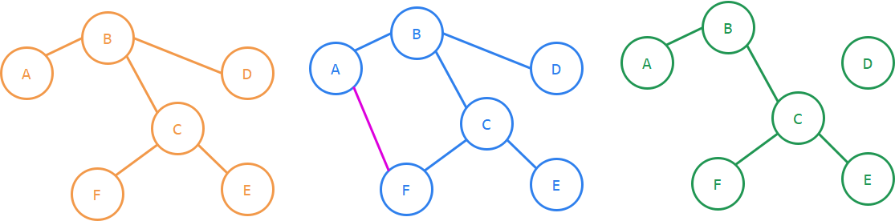

在上图中，左边的黄色部分是一棵树；中间的蓝色部分因为多了一条粉色边，形成了ABCF的环，所以不是一棵树；右边的绿色部分因为少了一条边，导致D和其他顶点不连通，所以也不是一棵树。

> 一般的无环图称为**森林**（forest），森林可以看成是一棵或多棵树组成的，它不需要满足连通性。

类似前面介绍过的数据结构，将树中顶点的数量称为树的**规模**（size）。计算机领域研究的树，规模总是有限值，因此称为**有限树**。

规模为0（没有顶点也没有边）的树称为**空树**。空树和规模为1（只有1个顶点，没有边）的树合称为**平凡树**，这2种特殊情形在分析树的相关性质时经常需要单独拿出来讨论，比如作为递归边界等。

### 树的基本性质

在这一节中，将会介绍很多树的数学性质。这些性质没有必要刻意记忆，在学习过程中理解就可以了。考试中遇到可以很容易地通过观察自行导出。

**命题1. 树的任意两个顶点之间，有且只有1条路可以连通。**

> “有1条”由树的连通性保证。
>
> “只有1条”由树的无环性保证。

在树上，只被1条边连接的点称为**叶子**。

**命题2. 非平凡树上至少有2个叶子。**

> 设`(A, B)`是树上不经过重复顶点的最长路。
>
> > 一条路径的**长度**，等于其经过的边数。
>
> 假设`A`被不在`(A, B)`路径上的边`(A, X)`连接，那么如果`X`是`(A, B)`经过的顶点，树上就有了环，矛盾；如果`X`不是`(A, B)`经过的顶点，`(X, B)`就是一条更长的路，和`(A, B)`最长性矛盾。
>
> 因此，`A`只被1条边连接，也就是`(A, B)`路径经过的那条边。同理，`B`也只被1条边连接。因此，树上至少有2片叶子。

记树的规模为`n`，树上的边数为`m`。

**命题3. 当n > 0时，m = n - 1。**

> 递归边界是`n=1`，此时恰好有`0`条边。
>
> 对于`n>1`，由于树上至少存在一个叶子`A`，将`A`以及连接`A`的那条边从树上删去，得到的就是一棵规模`n-1`的树。递归下去即可证明规模为`n`（`n>0`）的树上恰好`n-1`条边。

上述的两个命题用到了两个重要的技巧。

1. 最值反证法。通过取一个“最大”或“最小”的情况（树的规模有限，因此最值一定存在），让反证法的假设和最值矛盾。这种方法通常用于<u>数学性质的证明</u>，因此在考试中出现的频率比较低。
2. 递降法。这个方法在前面已经多次使用，在计算机领域，这种方法的使用频率会比反证法高得多；并且，<u>因为在计算机领域的树是**递归定义的**，所以它天然具有应用递降法的背景条件</u>，在下一小节将会展开介绍这一点。

下面两个对称的命题，证明非常简单，不再赘述。

**命题4. 在树上删除任何一条边，都会破坏连通性。**

**命题5. 在树上添加任何一条边，都会破坏无环性。**

### 有根树

回到树的问题上来。上述定义的数学上的树，是不具有半线性性质的。为了让其有半线性性质，需要规定树上的一个顶点为**树根**（root）。和大自然中的树不一样，树上的任何一个节点，包括叶子，都可以当做树根。

以上一节图中的树为例，下面展示了分别以A-F为树根得到的形态：

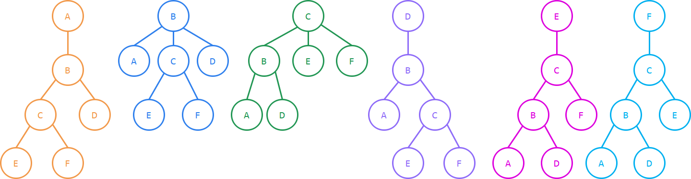

在确定了树根`r`之后，对于树`T`上的其他节点`v`，定义`v`的**深度**`depth(v)`为`v`到树根`r`的唯一路径的**长度**。

比如在上面的黄色树中，`A`是树根，那么`depth(B) = 1`，而`depth(C) = 2`。特别地，树根的深度`depth(r)`定义为`0`。规定了深度之后，就可以让同一深度的顶点排在一层，画成上面这种形式的图。对于深度为`k`的顶点`v`，就称`v`位于第`k`层。

> 有些教材会定义树根在第1层而非第0层，这违反了计算机学科从0开始计数的思维方式，从而会导致后面的一些等式和不等式多出一个额外的+1项，既不美观又不方便记忆。
>
> 考研试卷上如果出现这种定义，就是出卷老师刻意想坑一手没注意到的同学，请务必注意这个额外的+1。

上图中的6个树，尽管<u>在数学角度上看是拓扑同构的</u>，但是因为<u>规定的树根不同</u>，所以<u>在计算机角度上看是不同的树</u>。这是因为，在计算机角度研究的树，总是**有根树**，即定义了树根的树。之后如无特殊说明，笔记中所说的树都是有根树。

给定树的拓扑结构，根据给定的树根画出对应的有根树，这是一项基础技能，您应该已经掌握它了。

### 节点的关系

接下来介绍关于树的其他概念。

对于任意节点`v`，在`v`通往树根`r`上的唯一路径上的所有节点，都是`v`的**祖先**（ancestor），`v`是它们的**后代**或**子孙**（descendant）。<u>一个节点总是它自身的祖先和后代</u>。自身以外的祖先（后代）称为**真祖先**或**真后代**。

显然，一个位于第`k`层的节点，它的真祖先分别在第`k-1`、`k-2`、……、`1`、`0`层，一共`k`个。将它位于第k-1层的祖先，也就是和它直接有边相连的祖先称为它的**亲代**或**亲节点**（parent）。相应地，一个节点是它的亲代的**子代**或**子节点**（child）。拥有共同亲代的节点之间互为**姊妹**（sibling）。

> 这里稍微说明一下这几个名词的选取。
>
> parent、child和sibling最常见的翻译是“**父亲**”、“**儿子**”和“**兄弟**”，这种将数据结构树当成父系亲族树的说法还有“**堂兄弟**”“**祖父**”等（定义不再赘述），笔者认为这些写法不太妥当。另一些观点激进的翻译者，会将其翻译成“**母亲**”、“**女儿**”和“**姐妹**”，笔者认为这同样不妥当。
>
> > 在英文语境下，使用father、daughter等词语的文章也很多，因为读者都知道这些词汇的意义，所以并不会影响阅读和理解。当然，随着性别平等意识的兴起，近年的英文文献已基本规范为parent、child和sibling；但国内的文章有些翻译自较为古早的英文文献，因而<u>有可能是沿用了英文原文的性别色彩，并不是翻译者采用了带有性别色彩的译法</u>。
>
> 但是，parent常见的中性化翻译“**双亲**”有严重的误导性，容易让人误认为一个节点有2个parent。这个问题比“父亲”、“母亲”更加严重。
>
> 所以，在这本笔记中使用了一个冷门翻译“**亲代**”。
>
> 对于child，常见的中性化翻译“**孩子**”没有这个问题，不过为了对应，这里采用的也是冷门翻译“**子代**”。
>
> 对于sibling，直接沿用了常见的中性化翻译“**姊妹**”。
>
> 笔者相信虽然用的词汇不同，但您都是可以理解并轻松能够转换的。
>
> 在考试试卷上以上所有译名都可能出现，您应该采用和试卷上一样的译名。如果试卷没有给出，用上面任意的译名都是可以的。

### 子树

一个节点`v`的子节点数量称为它的**度数**或**度**（degree），记作`deg(v)`。

没有子节点（度为0）的节点称为**叶节点**或**叶子**（leaf）。

> 在规定了树根的树中，叶子都采用这个定义，而不是前面那个“只和一条边相连”的数学上的定义。
>
> 这两者的区别在于，<u>有且只有一个子节点的树根在这个定义下不再是叶节点</u>。因此，对于有根树而言，只能保证<u>非空树中至少有一片叶子</u>。

叶节点以外的节点统称为**内部节点**（internal node）。

一个节点`v`的所有后代及连接这些点的边也构成一棵树（您可以使用递降法证明），称为以节点`v`为根的**子树**`subtree(v)`。

> 子树的存在，意味着树可以被**递归定义**。
>
> 1. 递归边界：平凡树。
> 2. 一共`n`棵树，
>
> 因此，树上的命题总是可以用下面的递降法证明。
>
> 1. 要证明命题对树`T`成立，只要证明对于`T`的根节点的每个子节点`v`，命题对`subtree(v)`成立。
> 2. 递归边界：命题对平凡树成立。

因为一个节点就对应了一棵子树，所以在不引起歧义的情况下，节点和子树这两个词可以互相指代。

在树`T`中，所有节点深度的最大值称为树`T`的**高度**，记作`height(T)`，特别地，规模为`0`的空树的高度为`-1`。

对于树上的任意节点`v`，称以`v`为根的子树`subtree(v)`的高度，为`v`的**高度**`height(v)`。树的高度和根节点的高度相等。

**对于树T上的任意节点v，都有`depth(v) + height(v) <= height(T)`。**

> 这个命题您可以用上述的递降法轻易证明。

如果树上的每个节点的度数都不超过1，这棵树就<u>退化成了一条链</u>。退化成链的树，每一层都只有1个节点，它常常作为“最坏情况”的例子被用来分析一些算法在最坏情况下的复杂度，在后续章节中将会看到它发挥作用的地方。

另一种常常作为“最坏情况”的例子是<u>菊花图</u>。即，除了根之外，所有的节点都是叶子，整棵树只有2层。由于在拓扑上，这种树可以被画成一个中心节点辐射出`n-1`个“花瓣”节点的形状，所以被称为菊花图。

### 二叉树与有序树

如果树上的每个节点的度数都不超过2，则称其为**二叉树**（binary tree，下面简称为BT）。

> 因为计算机是二进制的，所以二叉树相对于一般的树，更适合在计算机中进行处理和分析。在下一节，您将会看到任何一棵普通的树或者森林，都可以被转换成二叉树进行处理。

在二叉树中，每个亲节点至多有2个子节点，所以可以用左、右来区分它们。

为了让对二叉树的分析讨论更具有一般性，可以将空树纳入讨论。这样，如果一个节点只有1个子节点，如只有左子节点，则认为，它的右子树是一棵空树。如果一个节点是叶子，则认为它的左右子树都是空树。这样，就使得对于二叉树上的每一个节点，都可以定义它的左右子树。

> 从数学角度看，交换左、右子树不会影响树的拓扑结构，但在计算机中存储数据总是有先后的，不存在真正意义上的、元素地位完全对称的“集合”。所以研究的总是**有序树**。
>
> 由于有序性，下图中的各树都是不相同的树。

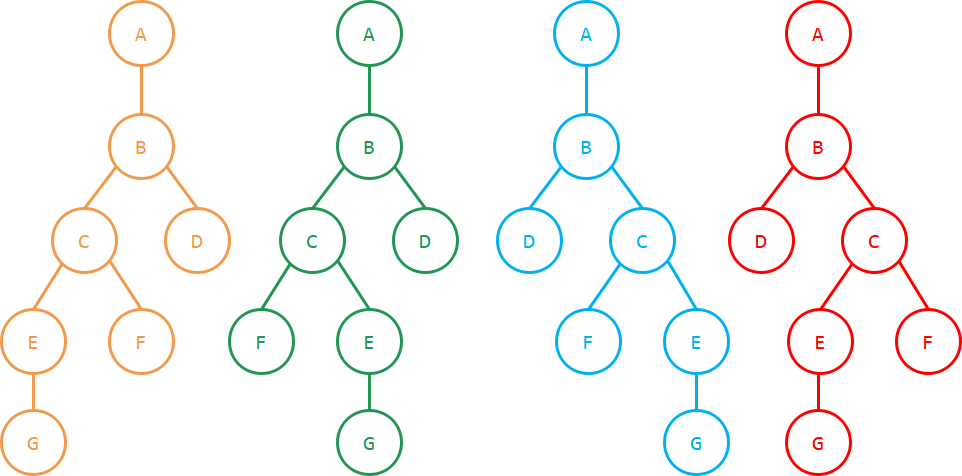

有序性和有根性一样，都是计算机领域的树，相对数学上的树所需要满足的特殊性质。

> <u>在二叉树的场合，有序性比一般的有序树更加严格</u>。这一点需要特别注意。
>
> 如果一个节点只有一个子代，那么对于一般的树而言，有序性的限制并不对这个节点起作用。
>
> 但对于二叉树而言，这个子代是左子代还是右子代，对应的是不同的二叉树。在这个地方，可以理解成二叉树的每一个节点都有两棵子树。如果两棵子树都是空树，则它是叶子节点，并且交换两棵子树得到的是同一棵树。只要有一棵子树不是空树，那么交换两棵子树得到的就不是同一棵树。
>
> 比如，在上面的四张图中，根据B、G两个节点是左子代还是右子代，每张图都可以衍生出4棵不同的二叉树。即，同一棵（节点度数不大于2的）无序树对应了$2^{t_2}$棵有序树、这每一棵有序树又对应了$2^{t_1}$棵二叉树；其中$t_1,t_2$分别表示度为1和2的节点数量。

### 满二叉树

对于一般的二叉树而言，内部节点的度数是可以为1的，也就是说，可以只有左子代，或者只有右子代。而如果每个内部节点的度数都为2（既有左子代又有右子代），则称其为**真二叉树**（proper BT）。

如果一棵真二叉树的所有叶子节点都在最底层，则它称为**满二叉树**（full BT）。满二叉树是特殊的真二叉树。

显然，平凡树都是真二叉树，并且也都是满二叉树。从定性的角度看，满二叉树是“图形被填得最满的二叉树”；从定量的角度看，则有下面的几个命题。

**命题1. 在一棵二叉树中，深度为k的节点至多$2^k$个。**

**命题2. 一棵高度为h的二叉树至多有$2^{h+1}-1$个节点。**

**命题3. 高度为h的满二叉树恰好有$2^{h+1}-1$个节点。**

> 上述命题都可以由归纳法证明。
>
> 在考试时使用公式的时候，只需要验证空树（规模0、高度-1），就可以验证自己的记忆是否出现了偏差；如果记忆有错，当场重新推导也并不困难。理解推导方法，会用特殊情况验证，就可以大大降低公式的记忆量。
>
> 另一方面，对于考试现场计算的更加复杂的公式，常常也可以通过平凡树、链、菊花图、满二叉树等典型的结构来进行验算。

### 完全二叉树

如果一棵二叉树满足：

1. 叶子节点都分布在最底层和次底层。
2. 最底层的叶子都分布在次底层叶子的左侧。
3. 若删去最底层的叶子，则得到一棵满二叉树。

则其称为**完全二叉树**（complete BT）。

满二叉树是特殊的完全二叉树。当然，作为特殊的满二叉树，平凡树也都是完全二叉树。

可以看出，完全二叉树的定义依赖于树的有序性。为了理解完全二叉树，您可以自己画图给出反例，从而证明下面的两个命题。

**命题1. 满二叉树既是完全二叉树，又是真二叉树。但，既是完全二叉树，又是真二叉树的不一定是满二叉树。**

**命题2. 完全二叉树不一定是真二叉树，真二叉树也不一定是完全二叉树。**

一个参考的图例如下。

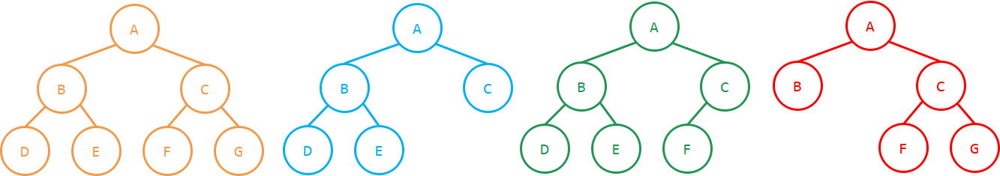

> 从左到右：
>
> 树1：满二叉树，完全二叉树，真二叉树。
>
> 树2：完全二叉树，真二叉树，但不是满二叉树。
>
> 树3：完全二叉树，但不是真二叉树。
>
> 树4：真二叉树，但不是完全二叉树。

完全二叉树可以看成是满二叉树的推广。满二叉树具有非常良好的性质，但受限于规模n只能是$2^{h+1}-1$​​​的形式，很难得到具有一般性的结果。将满二叉树推广成完全二叉树之后，仍然满足“图形被填得非常满”的特征，并且规模n可以是任意的。

由完全二叉树的定义，很显然地可以由上一小节得到的满二叉树规模公式，得到下面的**命题3**。

**命题3. 高度为h的完全二叉树，满足$2^h\le n\le 2^{h+1}-1$。**

> 左边的不等号在最下层只有一个叶子节点时满足；右边的不等号在满二叉树时满足。

此外，因为完全二叉树利用有序树的特性，规定了最下层叶子排列的位置，所以可以得到下面的**命题4**。

**命题4. 任给n，在规模为n的有序有根树中，有且只有一个是完全二叉树。**

这个命题指出，给定规模时，完全二叉树的结构是固定的。这使得当讨论完全二叉树的时候，可以不需要做结构上的分情况讨论，提供了分析上的简便。

### 带标号树

对于完全二叉树，只要给定规模n，就只存在一个满足条件的有序有根树。但是，这棵有序有根树上的节点显然是不同的数据单元。交换完全二叉树上的两个节点的位置，得到的显然是一棵新的树，尽管它的结构形态和原来的树完全一样。

> 有序树说明，同一个节点的两个子树交换位置，是两棵树。
>
> 带标号树说明，两个节点交换位置，是两棵树。

为了将不同的数据单元区分开，在有根有序树的基础上引入了标号。通常，将树上的每个节点标号为`0, 1, ..., n-1`；在各个节点存储的数据互不相同时，有时也用存储的数据为节点标号；此外，在示意图等场合，也可以用字母为部分节点标号。标号的唯一原则是<u>保证互不相同，从而可以区分不同的节点</u>。

为树上的节点做标号之后，就可以得到一棵**带标号树**。在绘制带标号树的时候，通常将标号写在代表节点的圈内。

> 到此为止，得到了计算机领域的树在数学上的定义：
>
> **树（计算机）是有根的、有序的、带标号的、有限的树。**
>
> 后文中，凡是不加指明地使用的“树”，均指**树（计算机）**。

由于节点和标号是一一对应的，所以在叙述时有时不对它们做区分。

### 根据树的性质建模

这一节中出现了很多定义，在考研的《数据结构》中，通常不会出现对于概念定义的考察，而是在理解概念的基础上，要求学生做一些简单的计算。和栈或队列要求您画图枚举不同，树相关的计算题通常数字比较大，让您列出方程或不等式求解。

方程或不等式的变量设法通常有两种，一种是按度设变量，一种是按层设变量。

> 笔者希望您掌握讨论此类题目的一般方法，而不是去记住尽可能多的结论。

**按度设变量**：在涉及度数的问题中通常采用按度设变量的方法。在二叉树中，设$n_0$​、$n_1$、$n_2$分别为度为0、1、2的节点数量（如果题目中有区分左右子代，则可以进一步将$n_1$拆分为$n_l+n_r$），就可以得到下面的限制条件：

1. $n_0­ + n_1 + n_2 = n$。（根据总节点数列出方程）

2. $n_1 + 2n_2 = n - 1$​。（根据总边数列出方程）

3. 如果是满二叉树，$n_1 = 0$且$n_0 = n_2 + 1$；

   如果是完全二叉树，$n_1 \le 1$；

   如果是真二叉树，$n_1 =0$。

**按层设变量**：在涉及高度的问题中通常采用按层设变量的方法。在二叉树中，设$n_k$​为第$k$层的节点数量（$k = 0, 1, 2, ..., h$），其中$h$​为树高（待定），就可以得到下面的限制条件：

1. $n_0 + n_1 + \dots + n_h = n$​。（根据总节点数列出方程）
2. $n_0 = 1$。（只有1个根节点，若不考虑空树的情况）
3. $1 \le n_k \le 2n_{k-1}$​。（根据二叉树性质列出不等式）如果是满二叉树，则对所有的$k$​都取等号；如果是完全二叉树，则对除$k = h$​外的$k$​都取等号。

对于一般的、非二叉的树，也可以列出类似的方程。

> 如果既涉及度数的问题，又涉及高度的问题，则可能需要将上面两种方法结合起来列出方程和不等式。

### 针对树的性质求解

下面从几个典型问题出发，应用这两种思路。

**问题1. 已知一棵完全二叉树有$l$个叶子结点，求它的总节点数。**

> 相当于在条件
> $$
> \begin{cases}
> l+n_1+n_2=n\\
> n_1+2n_2 =n-1\\
> n_1 \le 1
> \end{cases}
> $$
> 的条件下求$n$。将$n_1 = 0$和$n_1 = 1$分别代入，可以得到两个二元一次方程组，分别解之即可得$n$的两个可能值。

**问题2. 设一棵k叉树（k >= 2）的节点数为n，求它的叶子数量的取值范围。**

> 相当于在条件
> $$
> \begin{cases}
> n_0 + n_1+n_2+\dots+ n_k=n\\
> n_1+2n_2+\dots+kn_k =n-1
> \end{cases}
> $$
> 两个限制条件下，求$n_0$​的最大值和最小值。由于$n_i$​被限制为非负整数，使用Lagrange乘数法求解并不方便，应当使用不等式代换。
>
> 显然$n_0$的最小值是1（前面介绍过，有根树至少有一个叶子；并且在树退化成链的时候可以取到）。
>
> 为了让$n_0$​取最大，则$n_1 + n_2 + \dots + n_k$​应该尽可能小，而
> $$
> n_1+n_2+\dots+n_k\ge \frac 1k (n_1+2n_2+\dots+kn_k)=\frac{n-1}k
> $$
> 如果$(n-1)\%k=0$，则当$n_k = (n-1)/k$，其余为$0$时取最小；
>
> 如果$(n-1)\%k\ne 0$，则当$n_k =\lfloor                                 (n-1)/k\rfloor$  ，$n_{(n-1)\%k} = 1$，其余为$0$时取最小。

**问题3. 设一棵k叉树（k >= 2）的节点数为n，求它的高度的取值范围。**

> 相当于在条件
> $$
> \begin{cases}
> n_0+n_1+n_2+\dots+n_h=n\\
> n_0=1\\
> 1\le n_i\le kn_{i-1}
> \end{cases}
> $$
> 的限制条件下，求$h$的最大值和最小值。
>
> 最大值仍可以通过将树退化成链算出，此时$h + 1 = n$，$h_{max} = n-1$。
>
> 最小值则通过
> $$
> n = n_0 + n_1 + n_2 + ... + n_h \le 1 + k + k^2 + ... + k^h = \frac{k^{h+1}-1}{k-1}
> $$
> 可以算出，此时对应完全k叉树的情况。

另外，除了由于此类题目总是以选择题出现，所以您也可以直接取一些极端情况来快速得到答案。常用的极端情况包括完全k叉树、退化成链、菊花图和双链（向一个方向延伸的链，叶子作为另一个方向的子代挂在链上）。

## 二叉树及其遍历

上一节介绍的内容都是理论性的，这一节回到实际代码的实现上来。因为二叉树最为重要，本节先从二叉树出发展开讨论。随后，再迁移到一般的树和森林。

> 笔记中的二叉树实现和邓俊辉《数据结构》相比，倾向于可读性，而降低了一部分的简洁性和可扩展性。

### 二叉树的节点

因为二叉树上的节点，和列表一样，通过“链子”（亲代和子代之间的连边）连接，所以实现的方法也和列表有相似性。首先，对于单个的节点，定义一个结构体封装各个“链子”（指针）。

```c++
template <typename T>
struct BTNode {        // 二叉树的一个数据单元（节点）
    T value;           // 本节点存放的数据
    BTNode<T>* parent; // 指向本节点的亲节点
    BTNode<T>* lc;     // 指向本节点的左子代
    BTNode<T>* rc;     // 指向本节点的右子代

    // 判断是否是树根、左子代、右子代
    bool isRoot() const { return parent == nullptr; }
    bool isLeftChild() const { return !isRoot() && parent->lc == this; }
    bool isRightChild() const { return !isRoot() && parent->rc == this; }
    
    BTNode<T>(T e): value(e), parent(nullptr), lc(nullptr), rc(nullptr) {}
};
```

> 在上面的代码中，节点里既保存了指向亲节点的指针`parent`，又保存了指向子节点的指针`lc`和`rc`，因此被称为**亲代+子代表示法**。
>
> 就像双链表可以通过去掉一个方向的指针，变成单链表一样，“亲代+子代表示法”的二叉树也可以去掉一个方向的指针。
>
> 1. 如果去掉从子代指向亲代的指针`parent`，只保留指向子代的指针，则称为**子代表示法**。和单链表一样，它可以实现大多数的二叉树操作，因此有时会用来替代“亲代+子代表示法”，降低空间占用。
>
>    在后文介绍各个算法的时候，您可以自己思考是否可以在子代表示法上实现。
>
> 2. 如果去掉从亲代指向子代的指针`lc`和`rc`，只保留指向亲代的指针，则称为**亲代表示法**。“亲代+子代表示法”的绝大多数操作都无法被迁移到亲代表示法，因此这种表示法非常少见，也不是考研的重点。
>
> 由于有根树的性质，从树根沿着`lc`或`rc`指针，必然能够有一条唯一的路径到达树上的任一节点。
>
> 所以，在子代表示法中，任何节点都可以从树根出发探测到，从而在`BinaryTree`类中只需要保存树根。
>
> 但在亲代表示法中，这一性质不再满足，只能使用一个线性表来存储所有的节点。

在列表的场合，设计头尾哨兵可以有效地减少特殊情况的讨论。而在二叉树的场合，通常不需要增加“树根哨兵”和“叶子哨兵”，因为它们的用处不大。并且，树根哨兵会破坏二叉树的对称性（树根无论是树根哨兵的左子代还是右子代，都会造成二叉树向一个方向偏）；叶子哨兵则可能会浪费大量的空间（叶子的数量有可能是$\Theta(n)$​的）。

因此，在本章中，树根的`parent`指向`nullptr`，叶子的`lc`和`rc`、以及度为1节点没有子代的那一边，也指向`nullptr`。

### 二叉树

根据上一节的分析，对于“亲代+子代表示法”，任何节点都可以从树根出发探测到，从而在`BinaryTree`类中只需要保存树根。二叉树的模板可以定义如下。

```c++
template <typename T>
class BinaryTree {
private:
    BTNode<T>* _root;  // 指向二叉树的根节点
public:
    BTNode<T>*& root() const { return _root; }  
    BinaryTree(): _root(nullptr) {} // 构造函数，生成空树
};
```

> 如前所述，二叉树可以被这样递归定义：
>
> 1. 空树是二叉树。
> 2. 设节点`n`的左右子树`n->lc`和`n->rc`都是二叉树，则以节点`n`为根是二叉树。

> 但是，在上面的模板中没有办法体现这样的递归定义，因为根节点`_root`的左右子树，仍然是`BTNode`类型，而不是`BinaryTree`类型。而如果用`BinaryTree`类型会造成不必要的额外封装。
>
> 所以，在这一节中的代码，是围绕`BTNode`、以`BTNode`作为输入参数类型进行的，一个节点`BTNode`也就代表了以它为根的子树。`BinaryTree`作为一个类，仅仅作为二叉树相关的各个函数的封装入口，采用静态函数的形式。

### 二叉树的删除

要讨论二叉树的删除，首先会遇到的，是语义问题。

> 因为二叉树不再是线性结构，所以在插入或者删除一个新的节点时，语义会没有线性结构那么明确，需要进行明确。

首先，删除一个叶子节点，语义是清楚的。但如果删除一个内部节点，那么它的叶子应该如何处理呢？

1. 一并删除，即将删除的语义定义为<u>删除子树</u>。
2. 不删除，而是替代被删除节点的位置。如果被删除节点只有一个子树，那么很容易这么处理；但如果被删除节点有两个子树，则语义仍然是模糊的，没有显而易见的规定。

因此，如果使用不删除策略，往往需要对二叉树做额外的限制，使得被删除节点有两个子树的情况下，能够做出合理的语义规定。在这一章讨论的是一般意义的二叉树，所以使用的是删除子树的语义。

> 在很多教材中，这些语义是分开实现成多个函数的。本笔记中，笔者为简便起见将其统合为一个函数。考试时若要书写算法伪代码，为避免歧义，应注明规定的语义、或将函数的定义具体写出。
>
> 下一小节讨论的插入问题同理。
>
> 再次提醒，您不应该在语义问题上去刻意记忆，合理的语义规定（教材中，本笔记中，以及您自己做的规定）都是有价值的，理解如何进行语义规定即可。不合理的语义规定如数组从1开始计数等，这种做法在邓俊辉《数据结构》和本笔记中都不采用，有一些较早的教材可能会这样规定，这种地方才有必要刻意记忆。

```c++
// 问题4.1 - 二叉树的删除
// 给定：二叉树T
// 输入：被删除子树的根节点node
// 要求：将以node为根的子树删除
```

由于是使用指针的链接结构，所以在删除以`node`为根的子树时，必须要释放整棵子树上的所有节点的内存空间（否则会产生内存泄漏）。由于树是递归定义的，这个释放空间的过程也可以很容易地使用递归方法解决。

```c++
// 算法4.1 - 删除子树
template <typename T>
void BinaryTree<T>::removeSubtree(BTNode<T>*& node) {
    function<void(BTNode<T>*)> remove;
    remove = [&_size](BTNode<T>* node) -> void {
        if (node == nullptr) { // 递归边界：空树
            return;
        }
        auto lc = node->lc, rc = node->rc;
        delete node;           // 释放当前节点的空间
        remove(lc);            // 递归删除左右子树（尾递归）
        remove(rc);
    };
    remove(node);              // 递归删除子树
    node = nullptr;            // 这里node是上层的引用
}
```

`remove`函数是一个典型的尾递归，您可以利用上一章介绍的方法，将它改写成使用栈的无递归形式。

> 这里`node`是上层的引用，这让`node = nullptr`可以影响到二叉树未被删除的部分。
>
> 如`removeSubtree(_root)`，可以删除整棵二叉树，最后一句会让`_root`置为`nullptr`。而如果`removeSubtree(v->lc)`，则在删除节点`v`的左子树之后，最后一句会让`v->lc`这个指针被置为`nullptr`。

### 二叉树的插入

下面讨论二叉树的插入问题，同样，首先需要明确语义。

插入到叶子的位置，语义同样是清楚的。而把新插入的节点放在内部节点的位置上，则有一个问题：原先占有待插入位置的“旧节点”，在插入之后应该放在哪里呢？无论是放在新节点的左子代还是右子代，都属于“强行规定”，会破坏二叉树的对称性。为了保证对称性，有两种做法：

1. 直接把“旧节点”及其子树删掉。
2. 随机放在新节点的左边或右边。

在这一章，仍然只讨论最简单的情况，即，采用直接删除的语义。

```c++
// 问题4.2 - 二叉树的插入
// 给定：二叉树T
// 输入：待插入子树的目标亲代parent，被插入的位置pos，待插入子树的根节点node
// 要求：将以node为根的子树插入到pos的位置上
//      如果这个位置原先有子树，则将这个子树删除
```

> 插入单个节点的情况，只需要让`node`以`new BTNode<T>(e)`给出即可，可以认为是插入子树的一个特例。

这个算法的设计可以参考在列表的末尾添加节点，只需要连上“链子”即可。

```c++
// 算法4.2 - 插入子树
template <typename T>
void BinaryTree<T>::insertSubtree(BTNode<T>* parent, BTNode<T>*& pos, BTNode<T>* node) {
    removeSubtree(pos);        // 删除原位置的子树，注意这里pos是引用
    node->parent = parent;     // 更新被插入子树的亲代指针
    pos = node;                // 将新的子树挂载到pos的位置上
}
```

> 这里`pos`仍然采用引用的形式，可以对比上一小节的分析，理解使用引用的意义。

### 二叉树的递归遍历

下面讨论在二叉树上的查找问题。在线性表上做查找，只需要从线性表的开头到线性表的结尾，依次访问即可。但在二叉树上做查找，首先需要确定一个查找次序，使得能够“不重不漏”地访问到二叉树上的每一个节点。这个过程就是二叉树的**遍历**（traverse），从抽象的角度上说，就是**半线性结构的线性化**。

从递归的角度出发，可以很自然地想到，在二叉树`T`中遍历可以分成三步：

1. 访问树根`root`；（N，Node）
2. 递归地访问左子树`root->lc`；（L，Left）
3. 递归地访问右子树`root->rc`。（R，Right）

因为子树高度总是小于原树高度，所以最终可以达到递归边界（平凡树）。

本着这一思路，可以得到`3! = 6`种遍历方法。作为有序树，可以硬性规定，左子树总是先于右子树被访问；从而得到3种遍历方法（NLR、LNR、LRN）。

> 由于这三种遍历在这一节会讲的非常细致，有可能会有一些学生直接背诵了所有知识点；所以另外3种遍历方法（NRL、RNL、RLN），仍然有可能出现在试卷上，以考察您对二叉树遍历的实际掌握程度。

根据“访问树根”操作的位置，将NLR、LNR和LRN，分别称为**先序遍历**（pre-order traverse，又称**前序遍历**）、**中序遍历**（in-order traverse）、**后序遍历**（post-order traverse）。

```c++
// 问题4.3 - 二叉树的遍历
// 给定：二叉树T
// 输入：遍历访问函数visit，被遍历的子树树根node
// 要求：用visit遍历以node为根的子树
```

> 这里仍然针对子树去设计函数。遍历整棵二叉树只需要`traverse(_root)`，可视为一个特例。

```c++
// 算法4.3A - 先序遍历
template <typename T>
void BinaryTree<T>::preorderTraverse(function<void(BTNode<T>*)> visit, BTNode<T>* node) {
    if (node == nullptr) {  // 递归边界：空树
        return;
    }
    visit(node);            // 访问树根
    traverse(node->lc);     // 递归遍历左子树
    traverse(node->rc);     // 递归遍历右子树
}

// 算法4.3B - 中序遍历
template <typename T>
void BinaryTree<T>::inorderTraverse(function<void(BTNode<T>*)> visit, BTNode<T>* node){
    if (node == nullptr) {  // 递归边界：空树
        return;
    }
    traverse(node->lc);     // 递归遍历左子树
    visit(node);            // 访问树根
    traverse(node->rc);     // 递归遍历右子树
}

// 算法4.3C - 后序遍历
template <typename T>
void BinaryTree<T>::postorderTraverse(function<void(BTNode<T>*)> visit, BTNode<T>* node) {
    if (node == nullptr) {  // 递归边界：空树
        return;
    }
    traverse(node->lc);     // 递归遍历左子树
    traverse(node->rc);     // 递归遍历右子树
    visit(node);            // 访问树根
}
```

可以看出这三个函数只有递归次序的区别。

默认`visit`函数的时间、空间复杂度都是$O(1)$​的，那么您可以利用递归法，轻松证明三种遍历的时间复杂度都是$\Theta(n)$​，空间复杂度都是$\Theta(h)$​，其中`h`为二叉树的高度。在退化成链的情况下，空间复杂度会取到最坏的$\Theta(n)$​；而在完全二叉树的情况下，空间复杂度可以取到最好的$\Theta(\log n)$​。

### 用先序序列和中序序列重建二叉树

当使用先序遍历对二叉树进行遍历时，各个节点可以按照被访问的次序组成一个序列，称为**先序序列**。同理可以定义**中序序列**和**后序序列**。由于算法的确定性，对于一棵给定的二叉树，它的先序、中序和后序序列都是唯一的。

那么，就会自然地想到，如何基于先序序列、中序序列或后序序列，对二叉树进行重建呢？

> 首先，您可以递归证明，<u>先序序列（NLR）和后序序列（LRN）是具有对称性的</u>。
>
> *如果将二叉树中每一个节点的左右子树交换位置，再进行先序遍历，则得到的NLR序列相当于原二叉树的NRL序列，也就是原二叉树后序序列的反序*。
>
> 所以，先序序列+中序序列的情况，和后序序列+中序序列的情况，是对称的。在这一小节，笔者介绍利用先序序列和中序序列重建二叉树的方法，您可以在理解的基础上，自己推导利用后序序列和中序序列重建二叉树的方法。

```c++
// 问题4.4 - 重建二叉树（先序+中序）
// 输入：先序序列preSeq，中序序列inSeq
// 输出：重建的二叉树T
```

一个朴素的想法是，先序序列是NLR，中序序列是LNR，所以，先序序列的第一个元素就是二叉树T的树根`r`。在中序序列中寻找这个树根`r`的位置，`r`将中序序列分成了两部分，前半部分是`r->lc`的中序序列，后半部分是`r->rc`的中序序列。根据这两个序列的长度，对先序序列作出划分，也可以得到`r->lc`的先序序列，以及`r->rc`的先序序列。这样，算法就可以对两个子树递归下去；最终到达递归边界（空树）。

```c++
// 算法4.4A
template <typename T>
BinaryTree<T>* rebuildBinaryTree(const Vector<T>& preSeq, const Vector<T>& inSeq) {
    function<BTNode<T>*(int, int, int)> buildSubtree;
    buildSubtree = [&](int sP, int sI, int length) -> BTNode<T>* { 
        // 从 preSeq[sP:sP+len] 和 inSeq[sI:sI+len] 重建一棵子树
        for (int i = 0; i < length; ++i) {     // 找子树的根在中序序列上的位置
            if (inSeq[sI + i] == preSeq[sP]) { // 遍历中序序列直到找到先序序列首元素
                auto r = new BTNode<T>(preSeq[sP]);                // 重建树根节点
                (r->lc = buildSubtree(sP + 1, sI, i))->parent = r; // 重建左右子树
                (r->rc = buildSubtree(sP + i+1, sI + i+1, length-1-i))->parent = r;
                return r;                      // 重建子树完成
            }
        }
        return nullptr; // 递归边界：空树（length=0，不会进循环）
    };
    return new BinaryTree<T>(buildSubtree(0, 0, preSeq.size())); // 返回整个树的根节点
}
```

在**算法4.4A**中，由于在中序序列中找树根的过程是最坏$\Theta(n)$​的，所以可以证明，整个算法是最坏$\Theta(nh)=O(n^2)$​​的（退化成链，且所有内部节点都只有左子代时，取到$\Theta(n^2)$​）。这个时间复杂度并不能够让人满意。

> 递归计算的空间复杂度为$\Theta(h)$。考虑到二叉树本身需要$\Theta(n)$的存储空间，这一空间复杂度是可以接受的。

关于时间复杂度的优化，笔者留到进一步介绍各种二叉树遍历的形式之后。

> 本节介绍的内容有一个经典的推论：<u>已知先序序列和中序序列，可知后序序列</u>。（类似，<u>已知后序序列和中序序列，可知先序序列</u>）
>
> 这个问题是选择填空题的一个经典命题方向，其本质仍然是重建二叉树，而非直接从两个序列推出另一个序列。**算法4.4A**的思路<u>非常适合手工模拟</u>。

### 用先序序列和后序序列重建二叉树

如果已知的是先序序列和后序序列，则没有上一小节那么好的性质。

<u>已知先序序列和后序序列，有可能重建出不唯一的二叉树</u>。比如说，先序`(1,2)`，后序`(2,1)`的情况，无论2号节点是1号节点的左子代还是右子代，都满足给定的先序序列和后序序列。

<u>已知先序序列和后序序列，有可能重建出唯一的二叉树</u>。比如说，先序`(1,2,3)`，后序`(2,3,1)`的情况，您可以自己分析。

<u>已知先序序列和后序序列，有可能无法重建出二叉树</u>。比如说，先序`(1,2)`，后序`(1,2)`的情况，就无法重建出二叉树。

> 虽然性质很差，但在选择填空题中，仍然有可能要求讨论，在给定先序序列和后序序列的情况下，可以重建出多少棵二叉树。
>
> 和上一小节相似，可以推导出一个递归的计算方法。

首先，仍然可以将这两个序列分成`r`、`r->lc`和`r->rc`三个部分。

根`r`既是先序序列的第一个元素，又是后序序列的最后一个元素（若不满足此性质，则无法重建）。

下面考虑先序序列的第二个元素`c`。当`c`是后序序列的倒数第二个元素时，说明`r`只有1个子树（有左子树和右子树2种可能），该子树的先序（后序）序列就是整个树的先序（后序）序列除去`r`的部分。

当`c`不是倒数第二个元素时，说明`r`有2个子树，而`c`是左子树的根，从而`c`是`r->lc`的后序序列的最后一个元素，所以观察`c`在后序序列中的位置，就可以得到`r->lc`和`r->rc`的后序序列，并由其规模划分出`r->lc`和`r->rc`的先序序列。

> 可以看出，重建出的二叉树不唯一的原因，在于只有一棵子树的情况下，这棵子树在左还是在右都可以，不会影响到先序序列和后序序列。
>
> 因此，只需要重建出一棵二叉树，然后观察这棵二叉树上有多少个度为1的节点。当有$t_1$个度为1的节点时，则总共能重建出的二叉树数量为$2^{t_1}$​​​。您可以仿照上一小节的算法，构造一个利用先序序列和后序序列重建*一棵*二叉树的算法。<u>这个方法同样非常适合手工模拟</u>。
>
> 因为先序（或后序）序列给定的情况下，已知中序序列可以唯一构造出二叉树。所以，给定先序序列和后序序列，可以得到的中序序列数量，也是$2^{t_1}$​。

利用两个序列去重建二叉树，是二叉树遍历这个知识点上需要掌握的一项基本技能。

> 在配套代码中有随机生成二叉树的程序，您可以借助它自己练习。您应该很快就掌握了它。

### 二叉树的计数

在这一小节讨论，如果只知道*一个序列*，可以重建出多少个二叉树。

> 实际上，这个问题等价于规模为`n`的二叉树有多少种结构（有根、有序、无标号）。
>
> 因为给定一个二叉树的结构，其在某种遍历下各个节点被访问的次序是确定的，对应已知的遍历序列就可以知道每个节点上是什么标号。

设规模为`n`的二叉树有`T(n)`种结构，则递归边界是`T(0) = T(1) = 1`。为了计算`T(n)`，设树根的左子树有`k`个节点（`0 <= k <= n-1`），则右子树有`n-1 - k`个节点。于是，可以列出递归方程：
$$
T(n)=\sum_{k=0}^{n-1}T(k)\cdot T(n-1-k)
$$
相信您一定不会忘记这么经典的一个递归方程：这是上一章节介绍过的Catalan数的递归方程。

所以，由`n`个节点组成的二叉树恰好有$\mathrm{Catalan}(n)$种结构。亦即，如果只知道先序序列、中序序列、后序序列之一，可以构造出$\mathrm{Catalan}(n)$棵不同的二叉树。

### 表达式树

您一定对上一小节得到的结果$\mathrm{Catalan}(n)$​非常感兴趣。在介绍Catalan数的时候笔者曾经介绍过，计数问题有递归方程法和一一映射法两种途径，而如果用递归方程法求出结果是Catalan数，那一定存在某种一一映射关系，可以把待求解的计数问题，映射到出栈序列问题上。

从推导递归方程的角度，很容易建立下面的一一映射：

1. 对于空树，对应空的操作序列。
2. 对于根为`r`的树，设其左右子树对应的操作序列为`A`、`B`，则其对应的操作序列为`push(r) A B pop(r)`。

那么，可以用递归的方法，迅速在二叉树和栈之间建立桥梁：

1. 二叉树的先序序列，即对应操作序列的入栈序列。
2. 二叉树的后序序列，即对应操作序列的出栈序列。

> 入栈序列和出栈序列对应于何种二叉树的遍历序列，取决于上面的操作序列中，`push`、`pop`和两棵子树的位置关系。
>
> 在上面使用的操作序列是`push(r) A B pop(r)`。可以看出，如果用L、R代替`A`和`B`，用N代替`push`或`pop`，那么`push`（入栈序列）对应的就是NLR（先序序列），`pop`（出栈序列）对应的就是LRN（后序序列）。
>
> 将这个位置关系作出调整，比如说，如果使用`push(r) A pop(r) B`，那么入栈序列仍然对应先序序列，出栈序列变为对应了后序序列。您可以自己建立映射，让入栈序列对应中序序列，而出栈序列对应后序序列。
>
> 在这一小节为了引出和表达式的关系，选用了先序+后序的对应关系，您应当明白这不是唯一的一种映射方式。

您一定能够回忆起，在上一章中，表达式也分别对应了入栈序列和出栈序列。

1. 前缀表达式，对应操作序列的入栈序列。
2. 后缀表达式，对应操作序列的出栈序列。

所以，二叉树可以和表达式之间建立起一一对应的关系。由表达式转换得到的二叉树，称为**表达式树**。

> 严格来说，表达式树并不一定是二叉的，因为允许三目甚至多目运算符的存在。在这里为了方便，暂时认为表达式树中只包含双目或单目运算符。
>
> 对于单目运算符，可以认为它是一个操作数为空的双目运算符。比如，负号运算符：`-A`相当于`NULL - A`，而阶乘运算符：`A!`相当于`A ! NULL`。这里`NULL`表示操作数为空，在转换成二叉树时它对应空子树，从而能够既不出现在前缀/后缀表达式中，又不出现在先序/后序序列里。
>
> 这样，表达式中的所有运算符就都可以认为是双目的了，从而可以自然地使用二叉树表示。
>
> 在后面的几个小节里，都只讨论双目运算符（加、减、乘、除、乘方）的情况；配套代码中实现了一个包含负号和阶乘的例子。

表达式树可以被递归定义。

1. 空表达式对应空树。
2. 设表达式计算中的最后一步计算为$\oplus (A_1,A_2,\dots,A_n)$，其中$\oplus$为运算符，$A_1,A_2,\dots,A_n$为参与$\oplus$运算的子表达式（如最后一步为加法时，最后一步为$A_1 + A_2$）。那么，对应的表达式树的树根为$\oplus$，树根的子树依次为$A_1,A_2,\dots,A_n$对应的表达式树。

如上所述，当讨论所有运算符均为双目的表达式树（二叉树）时，有下面的性质：

1. 表达式树的先序遍历，是前缀表达式。
2. 表达式树的后序遍历，是后缀表达式。
3. 表达式树的中序遍历，在增加了表示运算次序的括号之后，是中缀表达式。

例如，下图展示的表达式树：

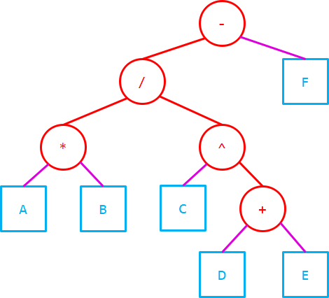

它的前缀表达式（先序遍历）是：`- / * A B ^ C + D E F`

它的后缀表达式（后序遍历）是：`A B * C D E + ^ / F -`

它的中序遍历是：`A * B / C ^ D + E - F`

加上适当的括号可以得到中缀表达式：`((A * B) / (C ^ (D + E))) - F`

### 用后缀表达式构造表达式树

从上一小节可以得到，只要知道三种表达式中的一个，就能够推出前缀表达式和后缀表达式，从而可以唯一确定入栈序列和出栈序列，从而也能唯一确定`push`和`pop`组成的操作序列。这$\mathrm{Catalan}(n)$个操作序列，恰好能对应$\mathrm{Catalan}(n)$​​种二叉树的结构；再加上入栈序列（先序序列）或出栈序列（后序序列），就能重建出二叉树了。

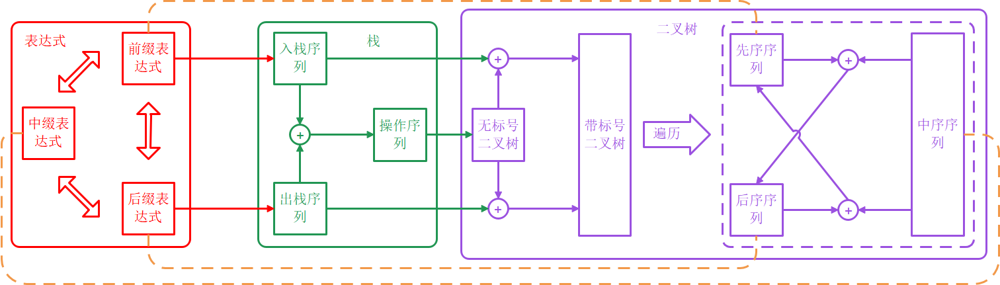

上图展示了表达式经由栈向二叉树的转换过程。反之，通过黄色的虚线边，表达式树也可以转换回三种表达式。

在上一章里重点讨论的是后缀表达式。在这里，笔者希望您不翻阅前面的内容，回忆出后缀表达式的计算算法（**算法3.2**）。

表达式树反映的是表达式的计算过程，只需要对计算算法略加修改，就得到了后缀表达式变换为表达式树的算法。

```c++
// 算法4.5 - 后缀表达式转换为表达式树
ExpressionTree::ExpressionTree(const SuffixExpression& exp) {
    Stack<BTNode<ExpressionElement>*> S;        // 构造使用的辅助栈
    exp.traverse([&](Rank, const ExpressionElement& e) -> void {
        auto v = new BTNode<ExpressionElement>(e); // 创建对应的节点
		if (e.isOperator()) {                   // 默认运算符都是双目的
            v->rc = S.pop();                    // 注意先出栈的是右子树
            v->lc = S.pop();
        }
        S.push(v);                              // 组合成子树，push回去
    });
    _root = S.pop();                            // 最后剩下的就是整个表达式树的根
}
```

其时间复杂度显然为$\Theta(n)$。空间上，即使不计算表达式树本身需要的$\Theta(n)$空间，辅助栈的空间在最坏情况下（右侧双链）也会达到$\Theta(n)$，最好情况下（左侧双链）则只需要$O(1)$；您可以自己构造例子理解这两种极端情况对应什么形式的表达式。

### 表达式树的计算

利用表达式树的递归定义，很容易得到表达式树的计算算法。只需要递归地计算每棵子树（子表达式）的值，然后用根节点上的运算符计算它们，就可以得到表达式树的值。

```c++
// 算法4.6 - 表达式树的计算
int ExpressionTree::getResult() {
    Stack<int> S;                               // 用于计算结果的辅助栈
    postorderTraverse([&](BTNode<ExpressionElement>* v) -> void {
        if (v->value.isNumber()) {
            S.push(v->value.getNumber());       // 如果是运算数，直接加入到栈中
        } else {
            int opCount = v->value.operationNumberCount();
            S.push(v->value.apply(Vector<int>(opCount, opCount, [&](int) -> int {
                return S.pop();
            })));                               // 否则取元素计算之后压回栈
        }
    });
    return S.pop();
}
```

**算法4.6**中时间复杂度、空间复杂度分析和**算法4.5**相似，请您自己完成。

在考试中，表达式的问题通常形式是：给出一个后缀表达式（或表达式树），让您求取它的值。对于表达式树，只需要在纸面上执行递归计算即可（并不需要实际使用辅助栈，因为可以把每棵子树的计算结果标记在它的树根旁边）。因为每一步计算对应树的一个内部节点，所以非常适合<u>检查计算是否正确</u>。

> 您已经在**算法4.5**中发现，后缀表达式转换成表达式树的过程，和后缀表达式的计算过程非常相似。所以，在您使用上一章的算法计算后缀表达式的值的同时，您可以将其转换成一棵表达式树。
>
> 随后，您可以通过对表达式树进行后序遍历，验证其和后缀表达式的等价性。并通过对表达式树再次进行计算，来对后缀表达式的计算结果进行验证。这一方法的好处是，可以利用表达式树适合检查的特点，提高做题的正确率。这是笔者建议的做法。

另一种题目是前缀、中缀、后缀表达式之间的相互转换。

> 笔者的建议是，这种问题统一将给定的表达式转换成表达式树进行处理。比如说中缀转后缀的问题，先构造表达式树，然后通过在表达式树上做中序遍历，验证和给定中缀表达式的等价性，再在表达式树上做后序遍历得到目标的后缀表达式。这一方法同样是为了方便检查、提高正确率。
>
> 在计算机中要将中缀表达式转换成表达式树，方法和**算法4.5**相似，是对中缀表达式的计算过程进行修改。但在纸笔上做这步转换并不需要这么复杂，因为中缀表达式是为人们所熟知的表达式形式，您一定已经习惯<u>总是从最高优先级的一步计算出发，而不是从左向右进行扫描</u>。比如`a+b*(c-d)`，您想要计算这个式子，一定会先从`c-d`开始，而不是从左往右地先看到`a+b`。所以，可以利用表达式树的递归定义，快速地将中缀表达式转换成表达式树。

### 无递归的先序遍历

**算法4.3**中介绍了递归形式的先序遍历、中序遍历和后序遍历，它们共同地基于二叉树的递归结构，具有高度的形式一致性，非常容易记忆。从这一小节开始，将陆续介绍这三种遍历的非递归形式；这里会用到上一章介绍的数据结构栈。

> 二叉树是递归定义的半线性结构，因此NLR、LNR、LRN是高度对称的，从而三种遍历的递归形式具有高度的形式一致性。
>
> 但栈是一个非递归定义的线性结构。当使用栈消除递归时，各个元素的入栈、出栈变成了线性的工作，NLR、LNR、LRN不再是对称的（位置关系发生了本质的变化），从而三种遍历的非递归形式（使用栈）在形式上具有显著的区别。
>
> 当然，您可以直观地发现NLR和LRN仍然是对称的，将NLR颠倒过来、再交换每个节点的左右子树就可以得到LRN。因此您可以预感到，在使用栈的场合，后序遍历和先序遍历仍然具有某种程度的形式一致性，这一点将在介绍无递归后序遍历的时候讨论。

这一节先讨论无递归的先序遍历。对于先序遍历来说NLR来说，递归部分`traverse(L)`和`traverse(R)`位于`visit(N)`之后，也就是函数`traverse(N)`的末尾。这是一个典型的尾递归，可以使用在上一章中介绍的模板解决。

> 如果您忘记了上一章中介绍的尾递归消除策略，可以在及时复习后，自己将**算法4.3A**改写成无递归的形式。然后和下面的示例代码对比。

```c++
// 算法4.3AS - 先序遍历（使用栈）
template <typename T>
void BinaryTree<T>::preorderTraverseStack(function<void(BTNode<T>*)> visit, BTNode<T>* node) {
    Stack<BTNode<T>*> S;
    S.push(node);             // 从树根开始遍历
    while (!S.empty()) {
        auto t = S.pop();     // 取出栈顶元素
        if (t != nullptr) {   // 如果非空
            visit(t);         // 则对其进行访问
            S.push(t->rc);    // 并将其左右子代依次入栈
            S.push(t->lc);    // 注意顺序是反的
        }
    }
}
```

上述算法有一定的优化空间。因为在访问一个元素`t`之后，如果它的左子代存在，下一个访问的必定是它的左子代。所以，没有必要执行将它的左子代入栈、再出栈的这一无效操作。在遍历到一个节点`t`时，可以沿着`lc`指针一直向下，访问沿途经过的所有左子代，然后回溯地、从深到浅地依次访问它们的右姊妹。

```c++
// 算法4.3AO - 先序遍历（使用栈，利用二叉树结构优化）
template <typename T>
void BinaryTree<T>::preorderTraverseStackOpt(function<void(BTNode<T>*)> visit) {
    Stack<BTNode<T>*> S;
    S.push(_root);                                         // 从树根开始遍历
    while (!S.empty()) {                                   
        for (auto t = S.pop(); t != nullptr; t = t->lc) {  // 对每个节点，沿着左子代到底
            visit(t);                                      // 访问沿途经过的节点
            S.push(t->rc);                                 // 并把右子代暂存到栈里
        }                                                  // 这样回溯时会从深到浅访问右姊妹
    }
}
```

和**算法4.3AS**相比，**算法4.3AO**在时间和空间上都有着一定程度的优化。

> 当然，这个优化程度非常小，而且破坏了**算法4.3AS**的形式美感。从记忆的角度上，笔者还是认为**算法4.3AS**更方便记忆。引入**算法4.3AO**，是希望从先序遍历（使用栈）自然地过渡到中序遍历（使用栈），帮助您理解下一小节的内容。

### 无递归的中序遍历

当讨论到中序遍历的时候，就不再是尾递归了。这意味着不方便使用**算法4.3AS**的消除尾递归的思路，但**算法4.3AO**的思路仍然有用。

对于先序遍历，一路向左下的过程中，会访问沿途经过的节点，然后在回溯时陆续访问右姊妹；而在中序遍历里，同样是一路向左下，但并不会访问沿途经过的节点，而是从最左下的那个节点出发，在回溯时陆续访问途径上的节点，然后再转入右姊妹。

所以，只需要在**算法4.3AO**上进行比较小程度的修改。

1. 在沿着左子代到底的过程中不访问经过的节点，而是将这些节点暂存到栈里。
2. 在回溯的过程中，再访问从栈里弹出的节点，然后转向其<u>右子代</u>。

```c++
template <typename T>
void BinaryTree<T>::inorderTraverseStackOpt(function<void(BTNode<T>*)> visit) {
    Stack<BTNode<T>*> S;
    auto pushLeftChain = [&S](BTNode<T>* node) -> void {   // 从node开始一路向左入栈
        for (auto t = node; t != nullptr; t = t->lc) {     // 沿着左子树迭代到底
            S.push(t);
        }
    };
    pushLeftChain(_root);                                  // 先将整棵树的最左侧通路入栈
    while (!S.empty()) {                                   // 开始回溯
        auto t = S.pop();                                  // 回溯到路径上的节点t
        visit(t);                                          // 访问回溯到的节点
        pushLeftChain(t->rc);                              // 然后转向右子树
    }
}
```

> 经典的迭代版本先序遍历（**算法4.3AS**）是直接由上一章所述的尾递归消除技术得到的，具有对称和简洁的美感，从而非常方便记忆。
>
> 而**算法4.3AO**、**算法4.3BO**以及下一节的**算法4.3CO**，由于利用了对二叉树结构及三种遍历性质的分析，算法的形式美感被破坏了，因此记忆上有一定的难度。利用后面介绍的线性递归思想，可以理解这些算法的设计思路，从而不需要记忆。

### 无递归的后序遍历

当考虑到无递归的后序遍历时，首先的想法是利用后序遍历和先序遍历的形式对称性。先序遍历是NLR，后序遍历是LRN，这两种遍历可以通过一种特殊的遍历（NRL）建立联系。

> 一方面，NRL和先序遍历（NLR）可以用完全一样的实现方法。如果使用**算法4.3AS**作为基础，唯一的区别是左右子树入栈次序的区别。如果使用**算法4.3AO**作为基础，则区别在于对每个节点，沿着右子代访问到底，然后沿着左姊妹回溯。
>
> 另一方面，NRL和LRN是完全逆序的关系。也就是说，NRL的遍历序列直接反转就可以得到后序序列（LRN）。

凭借NRL作为跳板，可以基于**算法4.3AS**得到下面的**算法4.3CS**。基于**算法4.3AO**的做法您可以自己写出来。

```c++
// 算法4.3CS - 后序遍历（使用栈，基于NRL作为跳板）
template <typename T>
void BinaryTree<T>::postorderTraverseStack(function<void(BTNode<T>*)> visit) {
    Stack<BTNode<T>*> S;      // 用来做NRL遍历的辅助栈
    Stack<BTNode<T>*> St;     // NRL的访问次序
    S.push(_root);            // 从树根开始遍历
    while (!S.empty()) {
        auto t = S.pop();     // 取出栈顶元素
        if (t != nullptr) {   // 如果非空
            St.push(t);       // NRL的访问（记录下访问次序）
            S.push(t->lc);    // 并将其左右子代依次入栈
            S.push(t->rc);    // 顺序和NLR（先序）相反
        }
    }
    while (!St.empty()) {     // 沿着NRL的反序访问
        visit(St.pop());      // 就是按照LRN（后序）的
    }
}
```

上面的想法是从后序遍历的反序，也就是NRL出发的，这意味着需要暂存整个NRL的访问次序，也就是需要$\Theta(n)$的空间复杂度。下面用从**算法4.3AO**和**算法4.3BO**的思路继续下去，从正向的后序遍历出发设计无递归的算法，这样只需要和递归后序遍历一样的$\Theta(h)$的空间复杂度。

> 在先序遍历的场合，最简单：一路向左下访问，然后沿着右姊妹回溯。
>
> 在中序遍历的场合，复杂些：一路向左下不访问，回溯时依次访问节点，再访问右姊妹。

在后序遍历的场合更加复杂。在一路向左下之后，不能直接回溯上去访问，而需要先遍历完右子树才访问。所以在中序遍历中不断向左下试探，后序遍历中就要先不断向左下试探、左下没了就向右下试探一步，然后再尝试向左下试探，直到试探到叶子为止，这样才能找到后序遍历的起点。在向上回溯的时候，也和中序遍历有所区别，如果是从右子树返回上去的，就访问亲节点，如果是从左子树返回上去的，不访问亲节点而是转向访问右子树。

```c++
// 算法4.3CO - 后序遍历（使用栈，优化）
template <typename T>
void BinaryTree<T>::postorderTraverseStackOpt(function<void(BTNode<T>*)> visit) {
    Stack<BTNode<T>*> S;
    auto pushChildChain = [&S](BTNode<T>* node) -> void { // 从node开始一路向下
        for (auto t = node; t != nullptr; t = t->lc != nullptr ? t->lc : t->rc) {
            S.push(t);     // 优先向左下，如果左下为空则向右下，迭代到叶子为止
        }
    };
    pushChildChain(_root);                 // 向下到底，找到后序遍历的起点
    while (!S.empty()) {                   // 开始回溯
        auto t = S.pop();                  // 取出栈顶元素，取出后S.top应该是t的亲节点
        visit(t);                          // 先访问t
        if (t->isLeftChild()) {            // 如果t是左子代
            pushChildChain(t->parent->rc); // 则进入右姊妹
        }                                  // 右子代则继续向上回溯
    }
}
```

> 这里`isLeftChild`由于`S.top()`是`t`的亲节点（您可以自行证明），所以可以实现为`!S.empty() && S.top()->lc == t`，从而不需要利用`parent`指针，在“子代表示法”的二叉树上也可用；当然，也可以利用`parent`指针，实现为`t->parent != nullptr && t->parent->lc == t`。

上述算法和**算法4.3BO**采用的设计思路和设计框架都是一致的。

### 遍历序列的直接后继

上面所有消除递归的讨论中，都没有用到`parent`这个指针。这是为了让这些算法在使用“子代表示法”的、没有`parent`指针的二叉树上也使用。接下来引入`parent`指针，从另一个角度研究二叉树遍历的非递归形式：

<u>如何找到一个节点在先序/中序/后序序列上的直接后继？</u>

您已经知道，先序序列的第一个元素是树根，中序序列的第一个元素是树根一路向左下试探的终点，后序序列的第一个元素是树根一路向左、无左则右试探的终点。

所以，只要能非递归地通过一个节点`v`找到它在遍历序列上的直接后继`succ(v)`，就可以从第一个元素出发、不断调用`succ`完成遍历了。

```c++
// 问题4.7 - 遍历序列上的直接后继
// 给定：二叉树T（亲代+子代表示法）
// 输入：二叉树T上的某个节点node
// 输出：某种（先序、中序、后序）遍历序列上，node的直接后继
```

这一节首先讨论先序的直接后继。借助**算法4.3AO**的思路，可以得到`succ`的确定方法。

1. 如果`v`有子代，则`succ`为其子代（左子优先）。
2. 如果`v`无子代，则沿`parent`指针向上回溯，途中如果有右姊妹，则`succ`为右姊妹。
3. 如果回溯到树根`root`仍没有右姊妹，则先序遍历结束。没有后继。

通过以上讨论，可以得到先序的直接后继时间复杂度是$O(h)$。

```c++
// 算法4.7A - 先序序列直接后继
template<typename T>
BTNode<T>* BinaryTree<T>::preorderSucc(BTNode<T>* node) {
    if (node->lc != nullptr) { return node->lc; } // 有左子取左子
    if (node->rc != nullptr) { return node->rc; } // 无左有右取右子
    while (!node->isRoot()) {
        if (node->isLeftChild() && node->parent->rc != nullptr) {
            return node->parent->rc;              // 有右姊妹则取右姊妹
        } else {
            node = node->parent;                  // 无右姊妹继续向上回溯
        }
    }
    return nullptr;                               // 回溯到树根仍然没有右姊妹，结束
}
```

中序的情况：

1. 如果有右子，则向右下一步，然后沿左下到底（直到没有左子为止），即右子的最左侧通路终点（参考**算法4.3BO**）就是`succ`。
2. 如果无右子，则向左上到底（直到遍历到左子或者根节点为止）。如果遍历到一个左子节点，则它的亲节点就是`succ`（右上一步）；如果遍历到根节点，则中序遍历结束，没有后继。

显然这个算法的时间复杂度也是$O(h)$。

```c++
// 算法4.7B - 中序序列直接后继
template <typename T>
BTNode<T>* BinaryTree<T>::inorderSucc(BTNode<T>* node) {
    if (node->rc != nullptr) { // 有右子，则向右下1步，再左下到底，和算法4.3BO一致
        for (node = node->rc; node->lc != nullptr; node = node->lc);
    } else {                   // 无右子，则向左上到底，再右上1步
        for (; node->isRightChild(); node = node->parent);
        node = node->parent;
    }
    return node;
}
```

最后讨论后序的情况：

1. 如果是根节点，后序遍历结束，没有后继。
2. 如果是右子，或无右姊妹的左子，则亲节点即是`succ`。
3. 如果是有右姊妹的左子，则从右姊妹出发一路向下（优先左下，无左则右）得到的叶子（参考**算法4.3CO**），即是`succ`。

```c++
// 算法4.7C - 后序序列直接后继
template <typename T>
BTNode<T>* BinaryTree<T>::postorderSucc(BTNode<T>* node) {
    if (node->isRoot()) { return nullptr; } // 根节点没有后继
    if (node->isRightChild()) { return node->parent; } // 右子的直接后继必是亲代
    if (node->parent->rc != nullptr) { // 左子，如果有右姊妹则直接后继是右姊妹的最左侧
        node = node->parent->rc;       // 一路向下，有左则左，无左则右，和算法4.3CO一致
        while (node->lc != nullptr || node->rc != nullptr) {
            node = node->lc != nullptr ? node->lc : node->rc;
        }
    } else {
        return node->parent;           // 如果没有右姊妹，直接后继也是亲代
    }
}
```

直接前驱的情况是相似的。注意到，先序遍历（NLR）的直接前驱，相当于反后序遍历（RLN）的直接后继。而RLN和真正的后序遍历（LRN）具有形式一致性，只需要调整L和R即可。所以，先序遍历的直接前驱算法，和后序遍历的直接后继算法是对称的。类似可以得到另外两种遍历的直接前驱和相应直接后继算法的对称性。

> 您可以由此写出三种直接前驱算法。

### 利用直接后继进行遍历

下面使用先序序列的直接后继`preorderSucc`作为跳板，构造一个新的、无递归的先序遍历算法。

```c++
// 算法4.3AL - 先序遍历（使用后继方法）
template <typename T>
void BinaryTree<T>::preorderTraverseSucc(function<void(BTNode<T>*)> visit) {
    for (auto p = _root; p != nullptr; p = preorderSucc(p)) {
        visit(p);
    }
}
```

> 使用后继方法实现中序遍历或者后序遍历，形式是完全一致的，不再赘述。

虽然每一步后继是$O(h)$的，但可以证明，**算法4.3AL**和之前介绍的递归及迭代的遍历方法一样，时间复杂度都是$\Theta(n)$​。

> 对树根`r`，假设`deg(r) = 2`（其他情况更简单）。
>
> 首先，因为遍历从`r`开始、（回溯）到`r`结束，所以从子代返回`r`的次数，不会多于从`r`进入子代的次数。
>
> 因为只有遍历`r`的时候会从`r`到`r->lc`，所以左子树只被进入`1`次。
>
> 又因为只有从左子树回溯、转向右姊妹的时候会从`r`到`r->rc`，所以右子树也只被进入`1`次。
>
> 这样，`succ`对二叉树的计算就递归地变成了对左右子树各`1`次计算，以及$O(1)$的对根节点的计算。递归边界是$O(1)$的平凡树。
>
> 从而可以得到**算法4.3AL**的时间复杂度为$\Theta(n)$​​​​​​。同时也能得到，<u>在一次先序遍历的过程中</u>，**算法4.7A**的分摊时间复杂度为$O(1)$​；或称，<u>在二叉树上等概率选取节点</u>，**算法4.7A**的平均时间复杂度为$O(1)$​​​。这里您可以体会并回顾一下分摊复杂度和平均复杂度的区别。

空间复杂度的问题上，**算法4.3AL**的空间复杂度是$O(1)$​，看上去比递归或用栈迭代的版本要小。但实际上，保存`parent`指针本身需要$\Theta(n)$​​的空间；从这个角度看，空间并没有被节约。

> 对于中序序列、后序序列的情况，证明方法类似，您可以自己尝试。

### 二叉树上的线性递归

在上面的各个小节，阐述了二叉树先序、中序、后序遍历的4种形式。

> 1. 递归形式（**算法4.3A**、**算法4.3B**、**算法4.3C**）。
> 2. 半线性递归转迭代（**算法4.3AS**、**算法4.3CS**）。
> 3. 线性递归转迭代（**算法4.3AO**、**算法4.3BO**、**算法4.3CO**）。
> 4. 利用后继（**算法4.3AL**及相应的中序、后序）。

这里用“半线性递归”和“线性递归”来区分两个类型，这是笔者为方便理解进行的概括。

在常规的递归思路下，一个二叉树会被递归到它的左右子树。这个思路利用了二叉树的天然的半线性性质（可称为**半线性递归**），除树高外，左右子树和原树具有结构相似性，左右子树之间具有对称性；这一良好的性质，使得以这个递归思路可以很方便地使用N、L、R三者的组合来设计树上的算法，且算法性能分析也较为简便。

**算法4.3A**、**算法4.3B**、**算法4.3C**都是半线性递归的算法。其中，只有**算法4.3A**是尾递归，可以直接用消除尾递归的方法，转换成迭代的形式**算法4.3AS**。后序遍历**算法4.3C**则可以利用NRL做跳板变换到对称的尾递归，从而用消除尾递归的方法转换成迭代的形式**算法4.3CS**。

而在**算法4.3BO**和**算法4.3CO**中，有一个共同的特点：当对二叉树进行遍历时，首先建立一条链，然后从底到顶地沿着这条链做回溯，同时递归地进入右姊妹。在**算法4.3BO**中，这条链是一路向左下，直到没有左子代为止的；而在**算法4.3CO**中，这条链是一路向下（优先左下），直到叶子为止的。

> 这两种构造链的策略同样被用来实现**算法4.7B**和**算法4.7C**。

将这两种无递归算法的思路抽象出来，可以概括为一个词：**线性递归**。

线性递归总是先找到树上的一条链，作为整棵树的“骨架”，然后沿着这条链进行递归。它本质上是一种<u>半线性结构（树）的线性化（链），从而实现线性的过程（遍历）</u>。因此，线性递归在处理和遍历相关的问题时，可能会具备常规的半线性递归不具备的优势；**算法4.3BO**和**算法4.3CO**就是体现优势的一个例子。

> 在邓俊辉《数据结构》中，这条作为“骨架”的链被形象地称为“**藤**”，而线性递归的思路被称为“**藤缠树**”。
>
> 线性递归的思路，在遍历序列这种线性问题上是有价值的，但它破坏了二叉树的天然半线性性质，子树线性表中的各个元素`T[0:n]`不对称。这会给算法的理解、分析和设计带来额外的复杂性。

在推导**算法4.3BO**时，借助了**算法4.3AO**的思路。本质上，**算法4.3AO**同样了使用**算法4.3BO**所使用的这一条“最左侧通路”作为藤，二者的关系如下图所示。

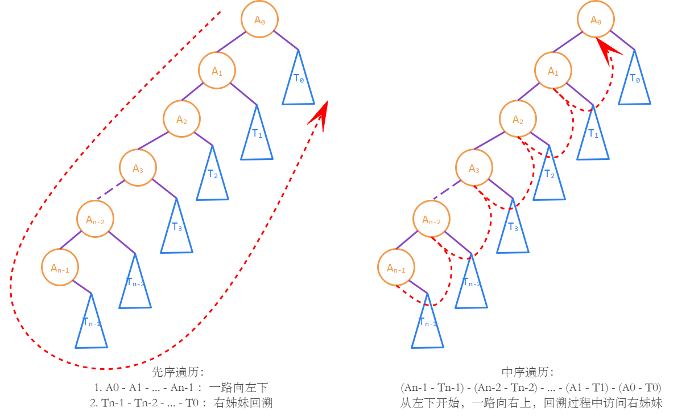

图中的红色虚线箭头表示了先序遍历和中序遍历的次序。您可以对照**算法4.3AO**和**算法4.3BO**，会发现，这两个非递归的算法，并不是由经典的半线性递归算法**算法4.3A**和**算法4.3B**引申出的，而采用的是上图所示的线性递归方法。

> 您可以根据上图所示的递归思路，将原始的树上的遍历，递归到`T[0:n]`上的分别遍历，实现相应的递归算法。这才是**算法4.3AO**和**算法4.3BO**本质上所基于的线性递归算法。

在使用最左侧通路的线性递归中，半线性的二叉树被拆解为一个<u>节点线性表</u>（最左侧通路）和一个<u>子树线性表</u>（最左侧通路挂载的右子树序列）。可以看出，先序遍历和中序遍历的区别，只不过是联合遍历这两个线性表的顺序的区别，而不会破坏线性表中的元素的内部结构。

### 拓展：基于线性递归重建二叉树

在此前的小节里，曾经讨论过利用先序序列和中序序列重建二叉树的问题。现在已经对先序遍历和中序遍历有更深刻的认识，可以回到这个问题上来了。利用先序序列和中序序列重建二叉树，这是一个<u>线性结构半线性化</u>的过程。那么，<u>在搭建半线性化结构时，可以采用线性的藤作为基础</u>。这就可以利用到线性递归的思路了。

线性递归反映出了先序序列和中序序列的内在统一性：它们可以被统一为最左侧通路序列、和它挂载的右子树序列的不同排列。

> 从上一小节的图中可以得到：
>
> 先序序列是`A[0] A[1] ... A[n-1] T[n-1] T[n-2] ... T[0]`。
>
> 中序序列是`A[n-1] T[n-1] A[n-2] T[n-2] ... A[0] T[0]`。

下面就基于最左侧通路`A[0:n]`和右子树序列`T[0:n]`，分析重建的过程。显然，只要知道了这两个序列，就可以在$\Theta(n)$的时间里将二叉树构造出来。

1. 因为中序序列的第一个元素是`A[n-1]`，而先序序列的前缀是`A[0:n]`。所以，从先序序列的第一个元素开始，检索到和中序序列第一个元素相等为止，得到的前缀就是最左侧通路`A[0:n]`。
2. 接下来，中序序列和先序序列的下一个元素都是`T[n-1]`，可以递归地进行重建。`T[n-1]`在中序序列上的右边界是已知的`A[n-2]`，当中序序列扫描到`A[n-2]`时，`T[n-1]`的重建结束，继续向上回溯，开始重建`T[n-2]`，以此类推，最终可以重建出右子树序列`T[0:n]`。

> 由于`lc`和`parent`指针的存在，最左侧通路`A[0:n]`实质上可以被当做一个双向链表。而在上述的重建算法中只包含顺序访问，不包含随机访问，所以这个双向链表已经够用，不需要额外花费空间去存储这个线性表。
>
> 当然，如果是子代表示法，没有`parent`指针，那么为了回溯，就必须要使用一个栈存储途经的节点，就像**算法4.3BO**一样，请您自己对下面的算法进行修改以完成这一功能。

```c++
// 算法4.4B
template<typename T>
BinaryTree<T>* rebuildBinaryTree2(const Vector<T>& preSeq, const Vector<T>& inSeq) {
    int i = 0, j = 0, n = preSeq.size();               // 先序和中序序列中的索引指针
    auto comeToEnd = [&](int end) -> bool {            // 子树终点标识符为preSeq[end]
        return end == n && j == n || preSeq[end] == inSeq[j]; // 当前访问到inSeq[end]
    };                                                 // 注意都溢出的情况也匹配
    function<BTNode<T>*(Rank)> buildSubtree;
    buildSubtree = [&](Rank end) -> BTNode<T>* {       // 构造子树的子程序，采用线性递归
        if (comeToEnd(end)) {                          // 递归边界是空树    
            return nullptr;                           
        }
        BTNode<T>* root = nullptr, * node = root;      // 子树的根节点作为root
        BTNode<T>*& pos = root;                        // 开始构造最左侧通路
        Rank l = i;
        while (i < n) {                                // 检索先序序列
            BinaryTree<T>::insert(node, pos, preSeq[i]); // 在最左侧通路上插入元素
            node = pos; pos = node->lc;                // 向左下继续构造
            if (preSeq[i++] == inSeq[j]) { break; }    // 检索到中序序列首元素为止
        }                                              // 最左侧通路构造结束
        Rank r = i;                                    // 此时最左侧通路为preSeq[l:r]
        for (++j; !comeToEnd(end); ++j) {              // 开始构造右姊妹序列（线性递归）
            if (--r < l) { r = end; }                  // 注意最后一棵右子树的终点在end处
            BinaryTree<T>::insertSubtree(node, node->rc, buildSubtree(r)); // 插入右子树
            node = node->parent;                       // 向右上方回溯
        }
        return root;                                   // 返回子树的根节点
    };
    return new BinaryTree<T>(buildSubtree(n));
}
```

> 代码比较长，没有必要记忆。如果您理解了前面所述的线性递归思路，可以很容易自己写出这个算法。

在整个重建过程中，每次循环要么`i`增加1，要么`j`增加1，要么一起增加1。这两个值作为先序、中序序列的索引，都不会超过`n`。所以循环的总次数不会超过`2n`，从而得到**算法4.4B**的时间复杂度是$\Theta(n)$。

空间复杂度上，因为是向右递归的，所以最大递归深度，等于$\max f(v)$，其中$f(v)$表示树根`r`到节点`v`的路径上，经过的`rc`指针的数量。最好情况是二叉树是左链的情况（只包含最左侧通路），此时所有递归都直接到达了递归边界，$\max f(v)=0$。最坏情况则是二叉树是右链的情况，$\max f(v)=n-1$。因此这个算法的空间复杂度为$O(n)$。

> 注意到，完全二叉树情况的空间复杂度是$\Theta(\log n)$，介于最好和最坏之间。这就体现出线性递归对半线性结构对称性的破坏：具有高度对称性的完全二叉树，不再成为最好情况。

中序+后序重建二叉树的问题，由于**算法4.3CO**线性递归所采用的藤并不是最左侧通路，所以并不能以**算法4.3BO**和**算法4.3CO**作为基础导出算法。不过显而易见，这种情况仍然可以利用后序遍历和先序遍历的对称性：只需要从后向前遍历两个序列，并用最右侧通路代替最左侧通路进行讨论即可。

### 拓展：基于后继重建二叉树

从**算法4.7B**、**算法4.7C**的设计中可以看出，后继方法本身是线性递归衍生出来的，可以看做是线性递归方法的一种变形。基于后继方法的**算法4.7AL**，和直接基于线性递归的**算法4.7AO**相比，需要支付额外的$\Theta(n)$空间作为代价（即存放`parent`指针所用的空间）。

在这一小节，介绍一种<u>基于后继</u>的重建二叉树方法。因为后继的思路是基于线性递归的，这个方法同样可以达到$\Theta(n)$的时间复杂度，但和基于后继的迭代一样，它也需要额外的$\Theta(n)$空间。以下，笔者将从<u>中序序列的后继</u>出发，完成二叉树的重建。

从**算法4.7B**中，您可以得到中序序列的后继所满足的性质：

1. 如果`v`有右子，则右下1步，再左下到底，得到`succ(v)`。
2. 如果`v`无右子，则左上到底，再右上1步，得到`succ(v)`。

这两者有一个共同点，就是`v`和`succ(v)`必定是祖先和后代的关系。而哪个是祖先、哪个是后代，则可以通过先序序列区分：<u>在先序序列上，祖先必定出现在后代之前</u>。

所以，有先序序列作为一个“比较器”的参考，就可以判定中序序列上的每一个元素的直接后继是它的祖先还是后代。从而，可以构造出下面的算法：

1. 根据先序序列构造一个比较器：即需要知道每个元素在先序序列上的位置。
2. 遍历中序序列，根据比较器的结果，决定`succ(v)`是向上还是向下延伸。

> 为降低比较器的构造复杂度，下面的算法强制要求二叉树的元素就是标号`0, 1, ..., n-1`。如果是一般的元素，这个构造比较器的过程需要使用后面的章节介绍的散列，才能在$\Theta(n)$的时间里完成。

```c++
// 算法4.4C
// 要求二叉树的节点上的元素即为标号0, 1, ..., n-1
BinaryTree<int>* rebuildBinaryTree3(const Vector<int>& preSeq, const Vector<int>& inSeq) {
    int n = preSeq.size();
    if (n == 0) { return new BinaryTree<int>(); }   // 空序列对应空树
    int* pos = new int[n];
    for (int i = 0; i < n; ++i) {
        pos[preSeq[i]] = i;                         // 记录在先序序列上的位置，作为比较器
    }
    auto u = new BTNode<int>(inSeq[0]);             // 中序序列上的当前节点
    for (Rank i = 1; i < n; ++i) {                  // 遍历中序序列
        auto v = new BTNode<int>(inSeq[i]);         // v = succ(u)
        if (pos[u->value] > pos[v->value]) {        // v在u前，即v是u的祖先
            auto p = u->parent;
            while (p != nullptr && pos[p->value] > pos[v->value]) {
                p = (u = p)->parent;                // 向上回溯，寻找插入的位置
            }
            if (p != nullptr) { p->rc = v; }        // 被插入为p的右子代
            v->parent = p;                          // 然后需要和回溯的这条链连接
            BinaryTree<int>::insertSubtree(v, v->lc, u);            
        } else {                                    // v在u后，即v是u的后代
            BinaryTree<int>::insertSubtree(u, u->rc, v);
        }
    }
    delete[] pos;
    while (!u->isRoot()) { u = u->parent; }         // 最后需要返回到树根
    return new BinaryTree<int>(u);
}
```

> 中序+后序的重建方法请您自己完成，注意到祖先和后代在后序序列上也满足一定的位置关系，只需要对上述算法做很小的改动即可。

**算法4.4C**的时间复杂度$\Theta(n)$是由中序遍历下，中序序列后继**算法4.7B**的分摊时间复杂度为$O(1)$所保证的。

如前所述，**算法4.4C**是基于<u>中序后继</u>设计的算法，因此可以很自然地联想到，也可以基于<u>先序后继</u>去设计算法事实上，**算法4.4A**就是基于先序后继的算法。回顾**算法4.4A**，如果利用建立`pos`表的方法回避掉在“在中序序列上找到先序序列的下一个元素”这样的步骤，就可以将时间复杂度降低到$\Theta(n)$。

> 您可以自己试验一下基于先序后继设计算法的过程，并和**算法4.4A**进行对比。

因此，**算法4.4A**和**算法4.4C**尽管形式上有一定的区别，思想上却都是基于后继的算法。和**算法4.4B**相比，这两种算法在空间上略有劣势（对于一般性的元素，需要利用到散列，空间上的劣势更大），但似乎更适合用来作为解决选择填空问题的手工方法。

### 拓展：表格方法重建二叉树

这一小节介绍一种基于**算法4.4A**或**算法4.4C**的后继思想，导出的手工重建二叉树方法。这种方法并非笔者原创，但笔者认为有一定的价值，并且能帮助您更深刻地理解基于后继的重建二叉树技术。使用该方法重建二叉树的例子如图所示。

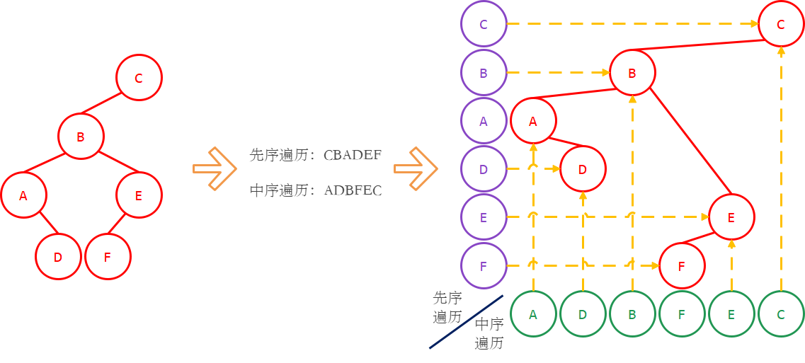

> 这个方法可以被总结为（参考上图中最右边的图示）：
>
> 1. 列一个棋盘形状的表格，纵坐标是先序遍历（从上到下），横坐标是中序遍历（从左到右）。
> 2. 根据表格上的横坐标和纵坐标，确定每个二叉树节点的位置（黄色虚线确定出红色节点）。
> 3. 在各个节点之间画上连接线即得二叉树。

这里是通过“列棋盘”的方式，建立了比较器`pos`（事实上是模拟了一个$\Theta(n^2)$的算法）。

接下来，在机器上，如果是从上到下构建二叉树的，则对应**算法4.4A**；如果是从左到右构建二叉树的，则对应**算法4.4C**；人脑因为没有必要线性思维，所以可以直接在这些节点上连线。

> 这种手工方法也很容易推广到中序+后序的情形。

### 线索二叉树

在二叉树中，只有度为2的节点的子代指针是被充分利用的，度为0或1的节点，它们有的子代指针指向`nullptr`，这些指针可以被利用起来，指示该节点在某种遍历序列中的直接前驱（`lc`）和直接后继（`rc`）。

因为规模为`n`的树中有`2n`个子代指针，而只有`n-1`条边，所以有`n+1`个子代指针是空闲的。这种对空闲指针的重用称为二叉树的**线索化**（Thread），线索化之后的二叉树称为**线索二叉树**（Threaded BT）。线索二叉树的节点中需要两个额外的标志字段来告诉用户，它的`lc`和`rc`指针指向的是子代还是线索。

> 在笔记的示例代码中，这两个标志字段被设置为`bool`类型，需要各占用`1`个字节。但事实上，各自只需要一个比特就能存储这个信息，有更节省空间的方法。

在画线索二叉树的时候，用实线表示子代指针，用虚线表示线索指针，并用箭头表示线索指针的方向。下面展示了一棵二叉树转换成（从左到右依次）先序、中序、后序线索二叉树的例子。

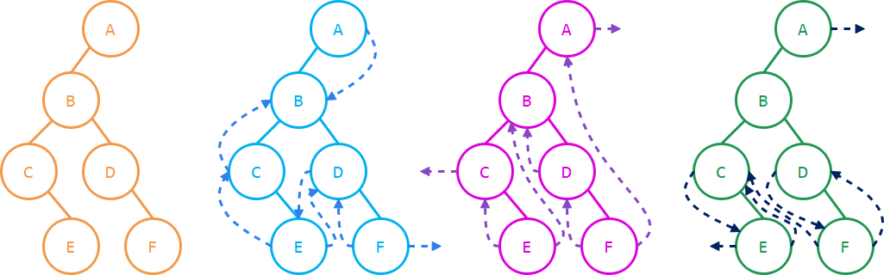

显然，对二叉树进行线索化，只需要进行一次相应遍历即可，其时间复杂度为$\Theta(n)$。

> 请您自己实现这一算法，并和示例代码中的程序对比。

从空间利用的观点看，<u>线索二叉树是一个“亲代+子代表示法”和“子代表示法”的折中产物</u>。

> 经典的“子代表示法”占用空间较小，但缺点是只能从上向下访问，不能从下向上访问。而“亲代+子代表示法”可以直接从下向上访问，具有更高的灵活性，但每个节点需要多占用一个指针的空间；所以诞生了线索二叉树这种灵活性和空间占用都介于两者之间的结构。

那么，就需要将“子代表示法”（使用线索）和“亲代+子代表示法”（不使用线索）的`succ`和`pred`进行对比。可以分成三类情况：

1. 先序的`succ`和后序的`pred`，用线索指针总是$O(1)$，用亲代指针最坏$\Theta(h)$（平均还是$O(1)$）。

2. 先序的`pred`和后序的`succ`，用线索指针无法取得。

3. 中序的`pred`和`succ`，用线索指针对时间复杂度没有影响，但可以得到常数层级的优化。

   亲代指针的做法，每个节点会被经过2次（向上和向下各会被经过1次）。

   线索指针的做法，每个节点只被经过1次（向下1次，向上时通过线索短路）。

   > 实际常数优化系数不一定是2，取决于具体的遍历实现。

因此可以得到的观点是，先序和后序的线索二叉树不如中序的线索二叉树有价值。

> 因为先序和后序的线索二叉树上，很多线索是指向下方的，这些线索并不能提供“向上访问”的灵活性；这一缺失，使得它只能在一个方向上做先序或后序序列上的遍历（如果没有亲代指针，那么先序线索二叉树无法确定`pred`，后序线索二叉树无法确定`succ`）。
>
> 但在中序的线索二叉树中，所有非空的线索都指向上方。线索足够多，即使没有亲代指针，也可以顺利地在两个方向上做遍历（需要借助头尾哨兵来指示中序的第一个和最后一个节点）。

### 层次遍历

在本节的最后，介绍另一种遍历方式：**层次遍历**（level order traverse）。

层次遍历和先序、中序、后序遍历都不同，且考到的可能性较低，所以放在最后介绍它。之前介绍的三种遍历（包括没有展开的NRL、RNL、RLN），都是基于递归的思想的，<u>在遍历的时候保持了树的拓扑结构</u>，位于同一子树的节点，在遍历时访问次序也靠近。而层次遍历从普通人的角度看更为直观：就是从上到下遍历每一层，在每一层从左到右访问每个节点。

<u>层次遍历会破坏树的拓扑结构</u>，所以，层次遍历的相关问题几乎无法使用递归的手段进行分析。但另一方面，层次遍历能保持遍历时访问深度的单调性，分析时往往从这个角度入手。

层次遍历先上后下、先左后右的特点和先序遍历是一样的。区别在于，对层次遍历而言，在访问第`k`层的时候，第`k-1`及更高的层必须全部访问完毕。所以，层次遍历需要使用*队列*代替先序遍历中的*栈*。

对**算法4.3AS**进行很小的修改，就可以得到层次遍历的算法。

```c++
// 算法4.3DS - 层次遍历
template <typename T>
void BinaryTree<T>::levelorderTraverse(function<void(BTNode<T>*)> visit, BTNode<T>* node) {
    Queue<BTNode<T>*> Q;
    Q.enqueue(node);         // 从树根开始遍历
    while (!Q.empty()) {
        auto f = Q.dequeue(); // 取出队列中的队首元素
        if (f != nullptr) {   // 如果非空
            visit(f);         // 则对其进行访问
            Q.enqueue(f->lc); // 并将其左右子代依次入队
            Q.enqueue(f->rc);
        }
    }
}
```

您可以看到**算法4.3DS**和**算法4.3AS**具有高度的形式一致性。根据这个一致性可得，二叉树上的节点进**算法4.3AS**栈和进**算法4.3DS**队列的次数也是一致的，从而层次遍历的时间复杂度仍然为$\Theta(n)$​​​。

空间复杂度视队列的实现方法而定，如果不允许释放或重复利用已出队元素的空间，则同样是$\Theta(n)$（请您自己回忆队列的相关知识点）；允许的情形，则为$\Theta(\max\limits_{0\le i\le h} n_i)=O(n)$，其中$n_i$是第$i$层的节点数量。

> 利用<u>出队节点的深度单调不减</u>，以及<u>一个节点和它的子代至多有一个在队列中</u>，可以证明在<u>同一时刻，队列中的元素只能出现在二叉树的相邻两层</u>。从而得到上述空间复杂度结论。

由于层次遍历和先序遍历的形式一致性，同样可以采用类似**算法4.4A**和**算法4.4C**的做法，来使用中序遍历序列和层次遍历序列重建二叉树。但因为层次遍历破坏了二叉树的拓扑结构，所以不再能使用**算法4.4B**的思路。

> 您可以分别从**算法4.4A**和**算法4.4C**的思路出发，设计在$\Theta(n)$时间里重建二叉树的算法。

另一方面，先序+层次、后序+层次都无法用来重建二叉树。您可以举例说明，由于层次遍历破坏了二叉树的拓扑结构，它的信息非常弱，先序+层次或者后序+层次划定的二叉树范围，比先序+后序要大得多；因此通常不会考虑先序+层次或后序+层次的重建问题。

> 选填中仍然可能出现，基本上数据规模非常小，可以通过枚举策略求解，不再赘述。

### 拓展：增强序列

这一小节讨论，如何基于一个遍历序列重建二叉树。

在之前已经介绍，中序序列加上先序、后序、层次中的任何一个序列（下面称序列X）都可以重建二叉树，并且具有一个通用的方法（**算法4.4A**和**算法4.4C**）。在这个通用的方法中，首先需要确定序列X上的各个元素在中序序列上的位置，随后就可以沿着序列X进行二叉树重建（或者相反，确定中序序列上的各个元素在序列X上的位置，然后沿着中序序列进行重建）。

这提供了一个信息，当使用序列X和中序序列重建二叉树时，中序序列事实上提供的是一个<u>位置信息</u>。那么反过来，<u>如果将这个位置信息标注在序列X上，那么就可以基于增强的序列X直接重建二叉树</u>。

下面讨论如何表示中序序列提供的位置信息。

对于一棵规模为`n`的二叉树`T`，用下面的方式对其补充节点：

1. 对于`T`上的度为0的节点，补充它的左右子代。
2. 对于`T`上的度为1的节点，如果它没有左子代，则补充左子代；如果没有右子代，则补充右子代。
3. 所有补充的节点上的数据为`^`（这个符号用来表示数据不存在，无其他意义）。

这样可以得到一棵新的二叉树`T'`。请您自己证明，新的二叉树`T'`满足下面的性质：

`T'`是规模为`2n+1`的<u>真二叉树</u>，且`T'`的内部节点就是`T`的节点，`T'`的叶子节点都是`^`。

> 这些不包含数据的叶子节点称为**外部节点**（external node）。需要注意的是，外部节点这个名词在不同语境下、不同的教材中可能会指代不同的对象；有些时候也将原二叉树的叶子节点直接称为外部节点。

在`T'`上进行某种遍历得到的、包含`^`的遍历序列，称为**增强序列**。一个例子如下图所示。

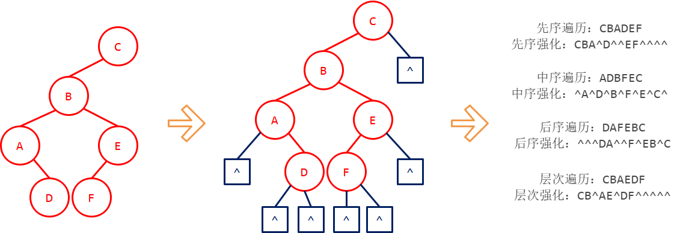

求一个二叉树的增强序列，并不需要实际地为二叉树添加`n+1`个外部节点将其扩展为`T'`。下面展示了一个先序增强序列的例子（外部节点以`nullptr`形式给出）。

```c++
// 算法4.11 - 求增强序列
// 给定：二叉树T
// 输出：二叉树的先序增强序列
//      其中原树节点以节点形式给出，外部节点以nullptr形式给出

// 算法4.11 - 构造增强序列
template <typename T>
Vector<BTNode<T>*> preorderEnhancedSeq(BTNode<T>* node) {
    Vector<BTNode<T>*> V;
    function<void(BTNode<T>*)> preorderEnhanced;
    preorderEnhanced = [&V](BTNode<T>* node) -> void {
        if (node == nullptr) {
            V.push_back(nullptr); // 和普通先序遍历的区别，外部节点也被加入
        } else {
            V.push_back(node);
            preorderEnhanced(node->lc);
            preorderEnhanced(node->rc);
        }
    };
    preorderEnhanced(node);
    return V;
}
```

您可以发现，**增强的中序序列**恰好是原中序序列和`^`交替的形式，因此外部节点确实包含了中序序列的位置信息。

> 在`T'`上，每一个内部节点都必然有右子，所以每一个内部节点的直接后继，都是它右子的最左侧通路终点。因为`T'`是真二叉树，所以没有左子的最左侧通路终点，必然也没有右子，从而是`T'`上的叶子节点，也就是一个外部节点。
>
> 因此，在增强的中序序列上，每一个内部节点的直接后继都是外部节点。同理可证直接前驱也是。结合内部节点的数量比外部节点少1个，可以得到增强的中序序列必定是原中序序列和`^`交替的形式。

那么，可以期望，增强序列就包含了原遍历序列的信息，以及中序序列相对原遍历序列的位置信息。从而可以通过增强序列来重建二叉树。

> 从信息的角度比较容易理解，但只能得到一个思路，通常不能得到确定性的结论。

为了说明增强序列确实可以用来重建二叉树，下面介绍另一种理解的思路：<u>表达式树</u>。

已知`T'`是一棵真二叉树，而表达式树也是真二叉树。`T'`的叶子节点对应外部节点，表达式树的叶子节点对应操作数。所以，`T'`的性质可以基于表达式树去研究。

> 在介绍表达式树的时候讨论过，一个长度为`2n`的栈操作序列可以唯一对应一棵规模为`n`的无标号二叉树，配合一个长度为`n`的入栈序列，就可以得到二叉树的先序序列（或出栈序列得到后序序列），从而为这棵二叉树标号。
>
> 讨论<u>增强的先序序列</u>。这个序列的第一个元素显然是`^`，去掉这个元素，剩余`2n`个元素中，`^`表示`pop`，非`^`的内部节点则表示`push`，就可以得到一个操作序列。（请您在不翻阅表达式树那一小节的证明的情况下，自己证明这一结论）
>
> 那么，这个操作序列就可以唯一确定二叉树`T`的结构（参考**算法4.5**）。再结合先序序列，就可以为`T`进行标号。
>
> 增强的后序序列情况类似，请您自己证明。
>
> 然后请您自己写出$\Theta(n)$时间里利用增强序列重建二叉树的算法。

新的问题是增强的层次序列。这是在表达式树那一节所没有讨论的，不过可以通过对二叉树的高度进行归纳。利用层次序列上各节点深度单调不减的特性，可以知道，<u>二叉树的前若干层组成的部分的层次序列，必定是整棵二叉树的层次序列的一个前缀</u>。这一性质为归纳法提供了基础。

> 本节得到的结论是，增强的先序、后序和层次序列都可以唯一对应一棵二叉树。这三种方法（尤其是从根开始的先序和层次）是经典的二叉树序列化方法。

## 树和森林

在本章的最开始定义了**树**（连通无环图）和**森林**（无环图）。这是数学上图论里的概念。后来，陆续引入了有根性、有序性、带标号性等概念；在这些性质的基础下，可以对这两个概念进行重构，并研究它们的性质。

### 树和森林的递归定义

递归定义**树**（tree）：

1. 递归边界：平凡树。
2. 非平凡树具有一个<u>树根</u>`r`，`r`的子树构成一个非空**森林**。

递归定义**森林**（forest）：

1. 递归边界：空森林。
2. 非空森林是<u>有序</u>的`k`个非空**树**组成的序列`T[0:k]`，其中`k > 0`。

这种相互递归的形式因为规模递减，所以不会产生无穷递归。

> 二叉树不是以如上方式定义的树的特殊形式。
>
> 因为二叉树允许一个节点没有左子代而有右子代，但对于上述方式定义的树，如果一个节点只有一个子代，那么必定是`T[0]`，而不允许`T[0]`是空树。

在程序实现上，相互递归的结构比较复杂，通常采用下面的实现方式。

```c++
template <typename T>
struct TreeNode {        // 树的一个数据单元（节点）
    T value;             // 本节点存放的数据
    TreeNode<T>* parent; // 指向本节点的亲节点
    Vector<TreeNode<T>*> children; // 指向本节点的子节点序列（向量，也可以使用列表）
    TreeNode<T>(T e): value(e), parent(nullptr) {}
};

template <typename T>
class Tree {
protected:
    TreeNode<T>* _root;  // 指向树的根节点
public:
    TreeNode<T>*& root() const { return _root; }  
    Tree(): _root(nullptr) {} // 构造函数，生成空树
};

template <typename T>
class Forest : public Vector<TreeNode<T>*> {
    // 用森林中各树的树根的序列（向量，也可以是列表）表示森林
};
```

> 在上面的实现方式中，直接使用`children`实现树到树的递归，而不使用森林作为中间件。这种方式可以

### 树和森林的计数

这一小节讨论，规模为`n`的树和森林各有多少个？

下面定义规模为`n`的树有$T(n)$个，规模为`n`的森林有$F(n)$个。

1. 递归边界：$T(0)=T(1)=1,F(0)=1$。
2. 因为非平凡树具有一个树根`r`，其他部分是一个森林，所以可以得到$T(n+1)=F(n)$。
3. 因为非空森林是有序的`k`个非空树组成的序列`T[0:k]`，其中`k > 0`，那么可以设`T[0]`的规模为`j`。对于规模为`n`的森林，则有`1 <= j <= n`。注意到`T[1:k]`也能构成一个森林（`k = 1`时是个空森林）。从而得到：

$$
F(n)=\sum_{j=1}^nT(j)F(n-j)
$$

代入$T(n+1)=F(n)$，可以得到方程：
$$
F(n)=\sum _{j=0}^{n-1}F(j)F(n-1-j)
$$
这个方程是您所熟悉的Catalan数递推方程，由$F(0)=1$可以直接得到$F(n)=\mathrm{Catalan}(n)$。

于是也能够推出$T(n)=\mathrm{Catalan}(n-1)$。

> 除了列方程法之外，也很容易用一一映射法得到$F(n)=T(n+1)=\mathrm{Catalan}(n)$。
>
> 定义空树（空森林）对应空的操作序列。
>
> 非空树对应的操作序列为`push O(F) pop`，其中`O(F)`是子树森林对应的操作序列。
>
> 非空森林对应的操作序列为`O(T[0]) O(T[1]) ... O(T[k-1])`，其中`O(T[j])`是森林中第`j`棵树对应的操作序列。
>
> 于是，规模为`n`的森林与规模为`2n`的栈操作序列建立了一一映射。

通过计数可以得到的结论是，相同规模的条件下，二叉树的数量和森林的数量是一致的，而树的数量比较少。这可以理解为，森林通过取消“连通”条件，获得了比树更大的灵活性；二叉树虽然被限制了“二叉”条件，但因为允许没有左子代、只有右子代，获得了更强的灵活性。

这个结论也暗示，可以建立二叉树到森林的一一映射，这将在后面的小节讨论。

### 树和森林转换为二叉树

由于计算机是二进制的，二叉树在处理问题时往往比较方便，所以经常需要将一般的树和森林转换成二叉树。在这一小节，介绍一种经典的树转换成二叉树的方法；下一小节将它推广到森林。

```c++
// 问题4.8 - 树和二叉树的转换
// 输入：树T
// 输出：和树T相对应的二叉树BT
```

在将一般的树`T`改写成二叉树的时候，对于`T`中的每个节点：

1. 它在二叉树中的左子代，是它在树`T`中的第一个子代；
2. 它在二叉树中的右子代，是它在树`T`中的下一个姊妹，

这个称为**“第一子代+下一姊妹”表示法**。

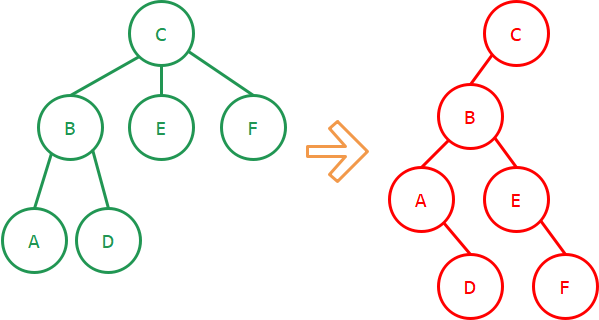

```c++
// 算法4.8A - 树->二叉树
template <typename T>
BTNode<T>* Tree<T>::toBinaryTree(const TreeNode<T>*& root) {
    if (root == nullptr) {       // 递归边界：空树对应空树
        return nullptr;
    }
    auto broot = new BTNode<T>(root->value); // 复制节点，创建树根
    BTNode<T>* p = broot;        // 下面开始逐一插入树上root的子节点
    BTNode<T>*& pos = broot->lc; // 即将被插入的节点位置
    root->children.traverse([&](Rank, const TreeNode<T>*& child) -> void {
        BinaryTree<T>::insertSubtree(p, pos, toBinaryTree(child)); // 递归插入子树
        pos = (p = pos)->rc;     // 下一姊妹会成为当前节点的右子代
    });
    return broot;
}
```

容易看出，**算法4.8A**的时间复杂度为$\Theta(n)$，额外空间为$O(1)$。

> 使用“第一子代+下一姊妹”表示法，手工进行树和二叉树的转换，是需要掌握的一项基本技能，可能会出现在选填命题中。

可以看出，如果采用“第一子代+下一姊妹”表示法，那么树转换成二叉树后，二叉树的根节点必定没有右子代（因为根节点没有“下一姊妹”）。排除掉这个根节点之后，剩下的`n-1`个节点构成了二叉树的左子树。在上一小节得到，树的形态共有$\mathrm{Catalan}(n-1)$种，而相对应的二叉树的左子树也有$\mathrm{Catalan}(n-1)$种，因此可以得知，这两者是一一对应的。

那么，就可以自然地想到**算法4.8A**的逆问题：已知一棵二叉树，且它的根节点没有右子代，求出“第一子代+下一姊妹”表示法下它对应的树。

> 请您自己设计这个算法，并和下面的示例对比。

```c++
// 算法4.8B - 二叉树->树
template <typename T>
TreeNode<T>* Tree<T>::fromBinaryTree(const BTNode<T>*& root) {
    if (root == nullptr) { // 递归边界：空树对应空树
        return nullptr;
    }
    auto troot = new TreeNode<T>(root->value); // 复制节点，创建树根
    for (auto c = root->lc; c != nullptr; c = c->rc) { // 遍历root->lc的最右侧通路
        auto subtree = fromBinaryTree(c);      // 递归生成子树
        subtree->parent = troot;
        troot->children.push_back(subtree);
    }
    return troot;
}
```

“第一子代+下一姊妹”表示法可以很自然地推广到森林上：在森林里的每一棵树的树根，它的“下一姊妹”就可以认为是“下一棵树的树根”。因此，森林转换成二叉树时，就不需要“树根没有右子代”这样的限定，从而成功建立了二叉树到森林的一一对应关系。请您自己写出森林和二叉树的互相转换算法。

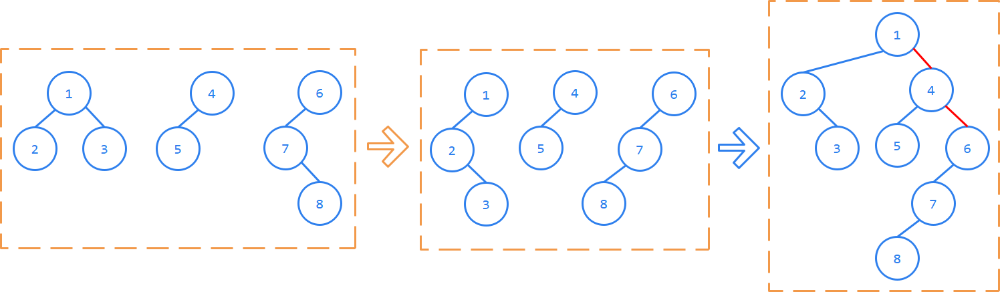

> 如上图所示，一种设计思路是，分别转换森林中的每棵树，然后用最右侧通路依次连接这些树所对应二叉树的根节点。

### 树和森林的遍历

在上一小节设计**算法4.8A**和**算法4.8B**的时候，您一定会发现，<u>二叉树的左子节点出发的最右侧通路</u>，在树和二叉树转换的过程中起到了重要的作用：这是一个典型的线性递归。那么，您就可能会去思考“第一子代+下一姊妹”表示法，和二叉树遍历之间的关系。

回忆之前设计的线性递归算法，您应当记得先序遍历和中序遍历，都和最左侧通路有关（并由此建立了先序+中序重建二叉树的**算法4.4B**），而后序遍历使用的藤在形式上有所不同。最左侧通路和最右侧通路是具有形式上的对称性的，因而可以去分析，“第一子代+下一姊妹”表达式法下，二叉树的先序序列和中序序列。

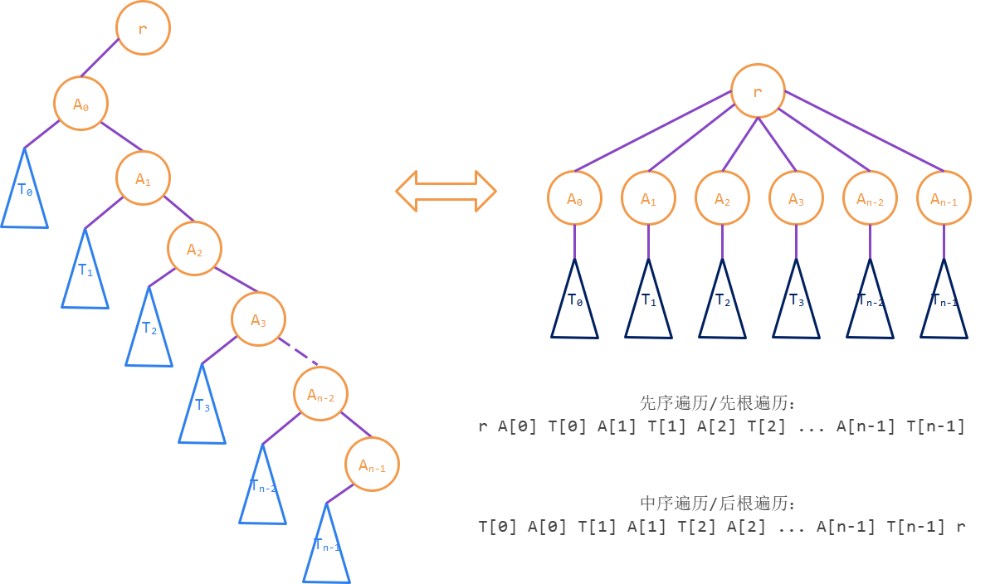

二叉树的先序序列和中序序列，可以分别对应到树上的**先根序列**和**后根序列**。这里的先根遍历和后根遍历，与二叉树的先序遍历和后序遍历具有形式一致性。先根遍历指的是`T[0:k] N`，对应先序遍历LRN；后根遍历指的是`N T[0:k]`，对应后序遍历NLR。

```c++
// 问题4.9 - 树的遍历
// 给定：树T
// 输入：遍历访问函数visit，被遍历的子树树根node
// 要求：用visit遍历以node为根的子树

// 算法4.9A - 先根遍历
template <typename T>
void Tree<T>::preorderTraverse(function<void(TreeNode<T>*)> visit, TreeNode<T>* node) {
    if (node == nullptr) { // 递归边界：空树
        return;
    }
    visit(node);
    node->children.traverse([&](Rank, const TreeNode<T>*& child) -> void {
        preorderTraverse(visit, child);
    });
}

// 算法4.9B - 后根遍历
template <typename T>
void Tree<T>::preorderTraverse(function<void(TreeNode<T>*)> visit, TreeNode<T>* node) {
    if (node == nullptr) { // 递归边界：空树
        return;
    }
    node->children.traverse([&](Rank, const TreeNode<T>*& child) -> void {
        preorderTraverse(visit, child);
    });
    visit(node);
}
```

基于上面的图很容易证明，二叉树的先序序列和树的先根序列、二叉树的中序序列和树的后根序列相等。

> 可以得到一个推论：已知树的先根序列和后根序列，可以重建树。
>
> 在讨论二叉树的“先序+后序”重建问题时，发现无法重建的原因在于无法确认只有一棵子树的节点是有左子树还是右子树。而在树的场合，如果只有一棵子树则必定是`children[0]`，不存在左子树和右子树的区分，所以先根+后根也就可以重建出树了。

最后，由于森林和二叉树是一一对应的，所以可以直接由二叉树的先序、中序、后序遍历导出森林的先序、中序和后序遍历。

您可以发现，对于森林`T[0:k]`转换成的二叉树，其根节点和根节点的左子树，对应森林的首树`T[0]`（两边都删去根节点，得到，根节点的左子树，对应森林首树树根`r(T[0])`的子树森林）；而根节点的右子树，对应森林里其余的树`T[1:k]`。

于是，就可以得到对于非空的森林及其对应的二叉树：

1. 二叉树的根节点，对应森林的首树树根。
2. 二叉树的左子树，对应森林的首树树根的子树森林。
3. 二叉树的右子树，对应森林的非首树森林。

根据这三部分的NLR、LNR和LRN的次序，就可以定义森林的先序、中序和后序遍历。

> 一般的树和森林，使用的场合很少，所以这一节的内容并不重要。但是，通过对于树和森林递归定义的理解，以及计数、转换两个经典问题，有助于让您对之前的知识加深理解。

## 二叉编码树

这一节讨论二叉编码树。

> 编码问题是计算机研究的一个基础问题，在《网络原理》和《组成原理》中，您将了解具体的编码方法，而在这一节讨论的是比较抽象的编码问题。

### 编码和解码

在现实世界中的信息是多种多样的，但计算机使用的是二进制，所有的信息都必须转化成二进制数据才能在计算机中存储和计算。信息转换成二进制数据的过程称为**编码**（encoding），将二进制数据还原成原始信息的过程称为**解码**（decoding）。

在编码问题中，信息的基本单位称为**字符**（character）。一种编码方法能够编码的字符必然是有限的，这些字符组成的有限集合称为**字母表**（alphabet，通常用大写字母$\Sigma$表示）。这里的字符和字母表是一个抽象的概念，并不是针对某种具体的语言而言的。

显然，编码规则不能让两个不同的字符映射成同样的二进制数据，否则解码方将无法对这个数据进行还原。所以，<u>单射</u>是一种编码规则成立的基本前提。

> 反之，<u>满射</u>则通常是不必要的。尽管不满的编码规则，可能会造成一些信息的浪费，从而增大表示一段信息需要的二进制长度，但不满的映射会造成另外一些好处：没有被对应到某个字符的编码（**冗余编码**）可以被用来表示一些控制信息（而不是数据信息）。
>
> 在《网络原理》中，会展开介绍这一问题。

### 前缀无歧义编码

那么，保证编码规则是单射是否就足够了呢？

事实上，仍然是不够的，因为在一长串的二进制数据中，并没有分隔符把不同字符的编码分割开来。比如，考虑这样一个对英文字母表的编码规则：字母A编码成1，字母B编码成11，字母C编码成111，以此类推……那么，无论原始信息是什么单词，编码之后得到的都是一大堆1，解码方只能知道总共有多少个1，难以解析出原始信息。

从这个例子中，您大概已经看出了一些端倪。导致编码结果在解码时遇到困难的罪魁祸首，就是其中一些字符的编码，是另一些字符的编码的前缀。

如果<u>字母表中任意两个字符的编码互相不为前缀</u>，则这种编码方案称为**前缀无歧义编码**（prefix-free code，简称PFC）。

> PFC一定能在解码时避免歧义，但不是只有PFC才能在解码时避免歧义。比如，字母A编码成1，字母B编码成10，字母C编码成100，以此类推……，这个编码显然不是PFC，但是解码方可以通过数每个1后面有几个0来完成解码。
>
> 具体何种编码可以避免解码歧义，可参考《形式语言与自动机》，在《数据结构》这门课不会进一步研究。

### 二叉编码树

对于任意一种编码方式，可以将其转化成**二叉编码树**（binary encoding tree）。

对于一个字符`c`，设`c`的编码为`B[0:n]`，其中每个位`B[i]`是`0`或`1`。从树根`r`出发，依次讨论每个`B[i]`，如果`B[i]`是`0`，就转向左子代，如果`B[i]`是`1`，就转向右子代（`0`左`1`右是习惯规定）；这样讨论完整个`B[0:n]`之后，所到的节点就是字符`c`对应的节点。下图举了两种编码方式转换成二叉编码树的例子。

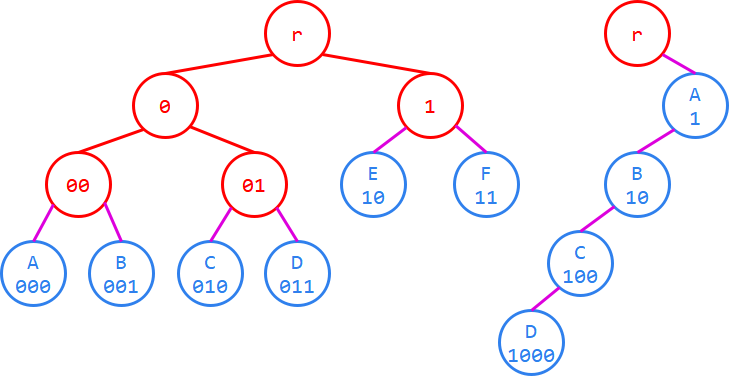

在上图中，左边是一棵PFC编码树，右边则是上一节举的那个无歧义的非PFC编码的例子。

在二叉编码树中，<u>所有的叶子节点都必须对应某个字符</u>（否则它们就没有理由被添加到二叉编码树中来）。

> 在不引起歧义的情况下，一个字符和它在二叉编码树中对应的节点可以互相指代。

容易知道，<u>在PFC编码树中，只有叶子节点才会对应某个字符</u>（因为祖先节点对应的编码，必定是后代节点的前缀，所以如果内部节点对应某个字符，就必定会成为另一个字符的编码前缀）；而非PFC的编码树中，内部节点也可能对应某个字符。

> 对非PFC的编码树的研究，在考研范围内不做讨论。

在已知二叉编码树的情况下，对PFC编码的解码非常简单。从树根`r`出发，考虑编码的每一位，按“0左1右”向下试探，每次试探到叶子节点时，就输出相应的字符，然后返回树根。

> 比如在上图左边的PFC编码树上解码序列“00110011”，先顺着“001”到达B，然后返回r，再顺着“10”到达E，最后顺着“011”到达D，解码结束，解码结果是BED。

### 最优编码树

对于一种PFC编码方式，它必定是无歧义的，因此正确性可以保证，只需要找一个标准去评价它的效率，而这一评价标准就是**编码长度**。对于同样的信息，当然是编码长度越短越好，因为这样就能用同样大小的存储器保存更多的信息、或用同样大小的带宽传输更多信息。

注意到，一个字符的编码长度就是它在PFC编码树的深度，所以平均编码长度也就是PFC编码树的**叶子节点平均深度**（average leaf depth，简称ald）。

> 在上一节举例的那个PFC编码树中，ald(T) = (3 + 3 + 3 + 3 + 2 + 2) / 6 = 8 / 3。

在字母表相同的无歧义编码规则中，平均编码长度最短的称**最优编码规则**，对应的编码树称为**最优编码树**。

为了分析最优编码树的形态，常规的思路是从极端情况入手。

> 要让一个“平均数”尽可能低，可以选取的极端情况通常有两种：
>
> 1. 尽可能均匀。
> 2. 尽可能离散。
>
> 在ald的场合，很容易构造出均匀的特殊情况（完全二叉树），这种情况下ald大约是$\log n$。而如果是离散的特殊情况（如双链），则ald会变为$\Theta(n)$之多。那么从朴素的思路出发，可以料想最优编码树应该就是均匀的情况。
>
> 接下来只需要用最优编码树去凑完全二叉树的性质即可。

### 最优编码树的性质

**性质：最优编码树必定是真二叉树**。

> 假设树上的某个节点`v`只有一个子代，那么将这个`v`删掉，用它的子代代替它。
>
> 经过这样的操作之后，`v`的子代为根的子树上的叶子结点深度减1，其他叶子节点深度不变，ald必定下降。因而原树必不是最优的。

**性质：最优编码树的叶子节点都分布在最底层和次底层**。

> 假设两个叶子节点`x`和`y`深度差至少为2，不妨设$\mathrm{depth}(x)- \mathrm{depth}(y) \ge 2$。
>
> 设`p`是`x`的亲节点，则$\mathrm{depth}(p) = \mathrm{depth}(x) - 1$。
>
> 那么，将`p`为根的子树和`y`的位置交换。可以得到：
> $$
> \mathrm{depth}(x’) + \mathrm{depth}(y’) = (\mathrm{depth}(y)+1) + (\mathrm{depth}(x)-1) = \mathrm{depth}(x) + \mathrm{depth}(y)
> $$
> 即交换前后，`x`和`y`这两片叶子的深度和不变。
>
> 但由于是真二叉树，`x`存在姊妹节点，`x`的姊妹节点为根的子树上的所有叶子深度都降低了。
>
> 因而交换之后的ald更小，原树必不是最优的。

上述交换的思路如下图所示。

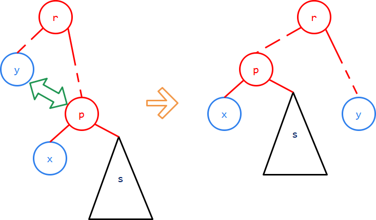

**置换节点**的思想是上面这个证明思路的核心。

> 置换节点在二叉树相关题目中出现频率不如列递归方程的方法高，但使用它解决的题目通常比较难。相比于基于算术的递归方程法，置换节点的思想主要用来解决基于拓扑的题目，它可以用来像上面一样证明某种拓扑结构，也可以用来做算法设计，即通过置换节点，将比较难以研究的拓扑结构化归到简单的拓扑结构处理。
>
> 在置换节点的时候，通常需要区分三类节点：<u>内部节点、叶子节点和不确定的节点</u>。在这个例子中，内部节点和叶子节点用不同颜色的圆形区分，而x的姊妹节点s是一个不确定的节点，所以用一个三角形来表示以它为根的子树。画出这种二叉树结构简图，有助于分析对二叉树上的拓扑结构作出的操作。

通过以上的分析可以得到：<u>真完全二叉树是一棵最优编码树</u>（对于给定的`n >= 2`，您可以解方程得到规模为`n`的真完全二叉树是唯一的）。且<u>所有的最优编码树，都可以基于真完全二叉树，通过改变最底层节点的位置得到</u>。

### 最优带权编码树

上一小节讨论的最优编码树并不实用。因为最优PFC编码基于ald，而ald认为每一个字符对评价标准的贡献是一样的。但实际应用时不是这样的。

> 比如，在中文编码中，回字有四种写法，“回”出现的频率显然远远高于“囬”、“囘”和“𡇌”，降低后三者的编码长度和降低“回”的编码长度，其价值显然不可等量齐观。

所以，在实际应用的时候通常用**叶节点带权平均深度**（weighted ald，wald）代替ald：
$$
\mathrm{wald}(T) = \sum_{v\in \Sigma} p(v)\cdot \mathrm{depth}(v)
$$
其中$p(v)$表示字符`v`的出现**频率**（frequency），应当满足：
$$
\sum_{v\in \Sigma}p(v)=1
$$

> 如果是在针对一段特定的信息编码，$p(v)$就是字符`v`在这段信息中出现的频率。如对字符串“SETSUNA”编码，则p(S) = 2/7。
>
> 如果对一般字母表（如英文字母表）编码，则$p(v)$可以由大量该语言文本统计得到，会在题目中给出。

以wald作为标准得到的最优编码树称为**最优带权编码树**。和最优编码树一样，最优带权编码树通常也不止一棵（显然任意内部节点左右子树交换就可以得到一棵新树）。

### Huffman编码

这一小节将介绍**Huffman编码算法**，它可以构造一棵最优带权编码树（称为**Huffman编码树**）。

```c++
// 问题4.10 - 构造最优带权编码树
// 输入：字母表A[0:n]，每个字符的频率p[0:n]
// 输出：最优带权编码树
```

> 这一知识点对于考研来说非常重要，是必须掌握（也很容易掌握）的基础知识。您需要确保能手工模拟这个算法。

推导构造最优带权编码树时，可以借鉴推导最优编码树时使用的两个性质。

1. 对于一个规模为`n`的字母表，它所对应的最优带权编码树`T`必定是一个真二叉树（证明方法和前面一样）。

2. 考虑字母表中频率最低和次低的两个字符`x`和`y`，因为`x`频率最低，所以`x`必定是最深的叶子（否则和最深的叶子交换，wald降低）。由`T`是真二叉树，`x`必有姊妹节点，若其不为`y`，将`y`和其交换，wald不增，因此可以设其为`y`。综上可知，在`T`中`x`和`y`可以为姊妹节点。

   > 这里`x`和`y`为姊妹不是必须的。因为显然，同一层的叶子互相交换位置不会影响wald。因此，并非所有的最优带权编码树都是Huffman树。

那么，考虑另一张字母表$\Sigma'$，这个字母表里没有`x`和`y`，而是增加了一个字符`z`，其中$p(z) = p(x) + p(y)$。

于是，在`T`中，只要把`x`和`y`这两片叶子删去，用它们的公共亲代（因为已经设了`x`和`y`是姊妹）代表`z`，就化归成了这个规模`n-1`的字母表$\Sigma'$的情况，如此递归下去，最终能达到递归边界（`n = 2`）。

上述分析得到的一个递归算法就是Huffman编码算法。

```c++
template <typename T>
struct WeightedValue {
    T value;
    double weight;
    WeightedValue(T e, double p): value(e), weight(p) {}
};

template <typename T> using WeightNode = BTNode<WeightedValue<T*>>;

// 算法4.10A - 朴素Huffman算法
WeightNode<T>* buildTree(const Vector<T>& A, const Vector<double>& p) {
    int n = A.size();                            // 字母表的规模
    if (n == nullptr) { return nullptr; }        // 递归边界：空树
    auto F = range(0, n).changeAll([](Rank r) -> WeightNode<T>* {
        return new WeightNode<T>(&A[r], p[r]);
    });                                          // 待合并的子树存放在向量F中
    auto w = [](const WeightNode<T>*& v) -> double { return v->value->weight; };
    auto cmp = [&w](const WeightNode<T>*& n1, const WeightNode<T>*& n2) -> bool { return w(n1) >= w(n2); };
    sort(F.data(), n, cmp);                      // 降序排列，频率最低的节点会被放置在末尾
    while (F.size() > 1) {
        auto x = F.pop_back(), y = F.pop_back(); // 频率最低的两个节点
        auto z = new WeightNode<T>(WeightedValue(nullptr, w(x) + w(y)));
        z->lc = x; z->rc = y;                    // 将x和y合并生成节点z
        F.sortedInsert(z, cmp);                  // 在有序向量F上插入节点z
    }
    return F.pop_back();                         // 最后一个节点就是整棵树的树根
}
```

> 上面这个算法中，在有序向量上做插入，最坏情况需要的时间是$\Theta(n)$，因此整个算法的最坏时间是$\Theta(n^2)$。而由于建立Huffman树至少需要知道各个字符的频率大小次序，所以预期算法应当能达到$\Theta(n\log n)$的最坏时间复杂度（和排序相当），因而**算法4.10A**有优化空间。
>
> 这里Huffman树的复杂度不小于排序，可以用归约的方法严格证明。即，对于一个离散程度充分大的排序问题（比如，每个数都大于比它小的数之和），可以用先建立Huffman树再层次遍历的方法，在$T(n)+\Theta(n)$的时间里解决。因此$T(n)+\Theta(n)=\Omega(n\log n)$，从而得到$T(n)=\Omega(n\log n)$。
>
> 利用之后的章节介绍的数据结构，可以对这个时间复杂度做出改进。
